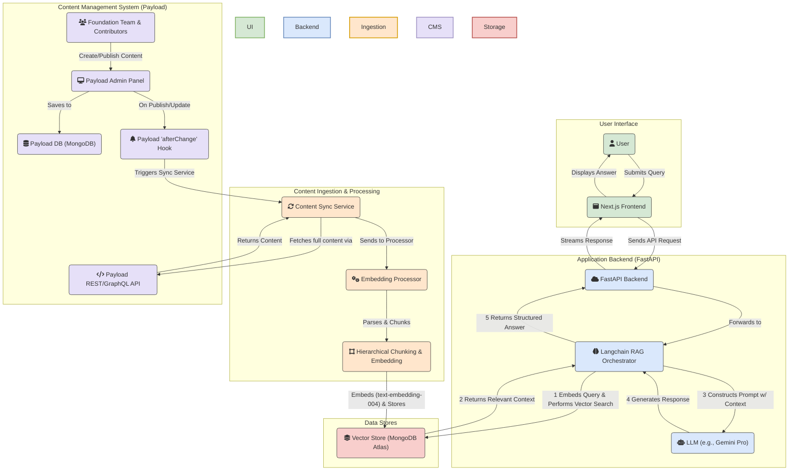

# **Litecoin Knowledge Hub**

## **Project Overview**

The Litecoin Knowledge Hub is an AI-powered conversational tool designed to serve the Litecoin community by providing real-time, accurate answers to a wide range of questions. Its core strength lies in its Retrieval-Augmented Generation (RAG) pipeline, which retrieves information from a human-vetted, curated knowledge base managed by the Litecoin Foundation through **Payload CMS**.

This project's value is not in competing with general-purpose AI models like ChatGPT or Grok, but in providing a specialized, high-accuracy information utility for the Litecoin ecosystem. By grounding responses in a canonical, trusted knowledge base, it aims to combat misinformation, enhance user experience, foster greater adoption, and provide a single, trustworthy source for everything related to Litecoin.

**Target Users/Audience:** Litecoin users (novice and experienced), cryptocurrency enthusiasts, developers building on Litecoin, and potential adopters seeking reliable information.

## **Project Status: 📝 In Progress**

The project has successfully completed the implementation of the core RAG pipeline and backend services. The current focus is on executing the migration from a proof-of-concept CMS to the production-ready **Payload CMS**, defining the final content schemas, and fully integrating it with the RAG pipeline's ingestion and synchronization services.

## **Key Features & User Stories**

* **Primary Goals:**  
  * Deliver accurate, real-time responses to Litecoin-related queries.  
  * Simplify user access to Litecoin information, reducing reliance on fragmented or unverified sources.  
  * Increase user engagement and trust in the Litecoin ecosystem through reliable, conversational support.

| Feature Area | Description |
| :---- | :---- |
| **Litecoin Basics & FAQ** | Provides clear, concise answers to fundamental questions about Litecoin, its history, how it works, and common terminology. Caters especially to new users. |
| **Transaction & Block Explorer** | Allows users to look up details of Litecoin transactions and explore block information. |
| **Market Data & Insights** | Delivers real-time Litecoin price information, market capitalization, and trading volume from reliable market APIs. |
| **Developer Documentation** | Provides quick access to snippets from Litecoin developer documentation and technical resources. |
| **Curated Knowledge Base** | A continuously updated library of well-researched articles and data serving as the primary source for the chatbot's answers. |
| **Payload CMS Integration** | A robust content management solution ensuring the quality and accuracy of the Knowledge Base with foundation-controlled editorial workflows. |

## **Project Roadmap**

### **Phase 1: MVP Core Foundation**

*The goal of this phase is to launch a functional, reliable chatbot based on a trusted, human-vetted knowledge base managed with professional editorial controls.*

* **Foundation Editorial Control:** Implement Payload's role-based system where community contributors create drafts and the Foundation team controls publishing decisions.  
* **Flexible Content Structuring:** Leverage Payload's customizable content types (collections) to structure data for optimal RAG performance.  
* **Real-time Synchronization:** Establish afterChange hook-based synchronization between Payload CMS and the RAG pipeline for immediate content updates.  
* **Initial Launch Content:** Provide clear, concise answers to fundamental questions about Litecoin.  
* **Production Deployment:** Deploy the frontend (Next.js), backend (FastAPI), and Payload CMS applications to their respective hosted services.

### **Phase 2: User Experience & Accuracy Enhancements (Post-MVP)**

*The goal of this phase is to increase user trust, engagement, and the precision of the RAG pipeline.*

* **Conversational Memory & Context:** Implement a stateful backend (using LangGraph) to retain conversation history, enabling users to ask natural follow-up questions.
* **Trust & Transparency (Source Citations):** Implement in-line citations in AI responses, linking directly to source documents.  
* **Contextual Discovery (AI-Generated Follow-up Questions):** Generate relevant, clickable follow-up questions after each response.  
* **Upgraded Retrieval Engine (Hybrid Search & Re-ranking):** Enhance retrieval accuracy by combining vector similarity with keyword search.  
* **User Feedback Loop:** Introduce a mechanism for users to provide direct feedback on AI answer quality.

### **Phase 3: Live Data & Developer Integrations (Post-MVP)**

*The goal of this phase is to expand the chatbot's capabilities by integrating real-time data sources and specialized developer tools.*

* **Transaction & Block Explorer:** Integrate live lookups for Litecoin transactions and blocks.  
* **Market Data & Insights:** Integrate real-time Litecoin price, market cap, and trading volume.  
* **Developer Documentation & Resources:** Ingest and provide quick access to Litecoin developer documentation.

## **Architectural Overview**

The architecture is designed around two primary workflows: **Content Ingestion** (managed via Payload CMS) and **User Query Processing** (the RAG pipeline).

## **Major Milestones & Timelines**

*(Timelines to be determined)*

| Status | Milestone | Focus |
| :---- | :---- | :---- |
| ✅ | [**M1: Project Initialization**](./cline_docs/milestones/milestone_1_project_initialization.md) | Core documentation and project setup. |
| ✅ | [**M2: Basic Project Scaffold**](./cline_docs/milestones/milestone_2_basic_project_scaffold.md) | Initial Next.js frontend and FastAPI backend. |
| ✅ | [**M3: Core RAG Pipeline**](./cline_docs/milestones/milestone_3_core_rag_pipeline.md) | Implemented data ingestion, vector search, and generation. |
| ✅ | [**M4: Litecoin Basics & FAQ**](./cline_docs/milestones/milestone_4_litecoin_basics_faq.md) | CRUD API for data sources and full ingestion of initial FAQ knowledge base. |
| 🟨 | [**M5: Payload CMS Setup & Integration**](./cline_docs/milestones/milestone_5_payload_cms_setup_integration.md) | Configure self-hosted Payload CMS and integrate its API and webhooks with the backend. |
| 📝 | [**M6: MVP Content Population**](./cline_docs/milestones/milestone_6_mvp_content_population_validation.md) | Populate Payload with the complete "Litecoin Basics & FAQ" knowledge base. |
| 📝 | [**M7: MVP Testing & Deployment**](./cline_docs/milestones/milestone_7_mvp_testing_refinement_deployment.md) | Conduct comprehensive testing, refine UI, and execute initial production deployment. |
| 📝 | [**M8: Implement Trust & Feedback Features**](./cline_docs/milestones/milestone_8_implement_trust_feedback_features.md) | Implement features from Phase 2 (UX/Accuracy). |
| 📝 | [**M9: Implement Contextual Discovery**](./cline_docs/milestones/milestone_9_implement_contextual_discovery.md) | Implement features from Phase 2 (UX/Accuracy). |
| 📝 | [**M10: Upgrade Retrieval Engine**](./cline_docs/milestones/milestone_10_upgrade_retrieval_engine.md) | Implement features from Phase 2 (UX/Accuracy). |
| 📝 | [**M11: Transaction & Block Explorer**](./cline_docs/milestones/milestone_11_transaction_block_explorer.md) | Implement features from Phase 3 (Live Data). |
| 📝 | [**M12: Market Data & Insights**](./cline_docs/milestones/milestone_12_market_data_insights.md) | Implement features from Phase 3 (Live Data). |
| 📝 | [**M13: Developer Documentation**](./cline_docs/milestones/milestone_13_developer_documentation.md) | Implement features from Phase 3 (Live Data). |

## **Log of Completed Milestones**

* **Strategic Decision: CMS Pivot to Payload (6/19/2025)**  
  * Conducted a comparative analysis of headless CMS options and selected Payload to better align with the project's long-term RAG and data governance goals. This decision enables the work for Milestone 5\.  
* **Milestone 4: Backend & Knowledge Base Completion (6/7/2025)**  
  * Implemented a full suite of CRUD API endpoints (/api/v1/sources) for managing data sources and successfully ingested the entire initial knowledge base.  
* **Milestone 3: Core RAG Pipeline Implementation (6/6/2025)**  
  * Implemented and tested the end-to-end pipeline, including multi-source data loaders, Google Text Embedding 004, MongoDB Atlas Vector Search, and a gemini-pro generation layer. Enhanced pipeline with hierarchical chunking and metadata filtering.  
* **Milestone 2: Basic Project Scaffold (6/5/2025)**  
  * Frontend (Next.js) and Backend (FastAPI) directory structures established with basic functionality confirmed.  
* **Milestone 1: Project Initialization & Documentation Setup (6/5/2025)**  
  * Initial project documentation (cline\_docs) created and populated.

## **Technology Stack**

For more details, see cline\_docs/techStack.md.

* **Frontend:** Next.js, TypeScript, Tailwind CSS  
* **Backend:** Python, FastAPI, Langchain  
* **AI/LLM:** Google Text Embedding 004, Gemini Pro  
* **Content Management:** Payload CMS (self-hosted)  
* **Database:** MongoDB, MongoDB Atlas Vector Search  
* **Deployment:** Vercel (Frontend), TBD (Backend, Payload)

## **Getting Started**

### **Prerequisites**

* Node.js v18.18.0+  
* Python 3.x  
* Access to a self-hosted Payload CMS instance and MongoDB database.

### **Running Development Servers**

1. **Frontend (Next.js):**  
   cd frontend  
   npm install  
   npm run dev  
   \# Frontend available at <http://localhost:3000>

2. **Backend (FastAPI):**  
   cd backend  
   python3 \-m venv venv && source venv/bin/activate  
   pip install \-r requirements.txt  
   cp .env.example .env && \# Edit .env with your credentials  
   uvicorn main:app \--reload  
   \# Backend available at <http://localhost:8000>

## **Contributing**

This project thrives on community contributions to its knowledge base via Payload CMS. The Litecoin Foundation maintains editorial control while enabling community participation. Please contact the Foundation for contributor access.

## **License**

(To be determined \- e.g., MIT License)
