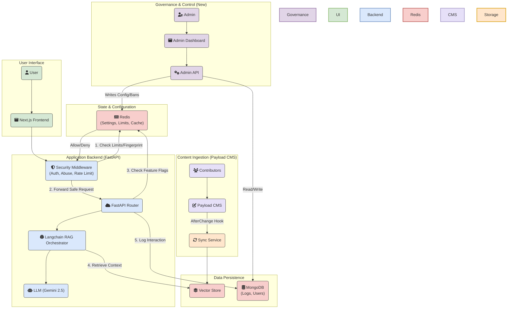

# **Litecoin Knowledge Hub**

## **Project Overview**

The Litecoin Knowledge Hub is an AI-powered conversational tool designed to serve the Litecoin community by providing real-time, accurate answers to a wide range of questions. Its core strength lies in its Retrieval-Augmented Generation (RAG) pipeline, which retrieves information from a human-vetted, curated knowledge base managed by the Litecoin Foundation through **Payload CMS**.

This project's value is not in competing with general-purpose AI models like ChatGPT or Grok, but in providing a specialized, high-accuracy information utility for the Litecoin ecosystem. By grounding responses in a canonical, trusted knowledge base, it aims to combat misinformation, enhance user experience, foster greater adoption, and provide a single, trustworthy source for everything related to Litecoin.

**Target Users/Audience:** Litecoin users (novice and experienced), cryptocurrency enthusiasts, developers building on Litecoin, and potential adopters seeking reliable information.

## **Project Status: 📝 Phase 1 Nearly Complete**

The project has successfully completed the implementation of the core RAG pipeline and backend services, including **conversational memory and history-aware retrieval** that enables natural follow-up conversations. The **Payload CMS integration is now fully operational** with complete content lifecycle management (draft → publish → unpublish → delete) and real-time synchronization. **Comprehensive monitoring infrastructure** (Prometheus, Grafana) and **question logging** have been implemented to track system performance and user queries. The current focus is on populating the CMS with comprehensive Litecoin knowledge base content and preparing for MVP testing and deployment.

## **Key Features & User Stories**

* **Primary Goals:**  
  * Deliver accurate, real-time responses to Litecoin-related queries.  
  * Simplify user access to Litecoin information, reducing reliance on fragmented or unverified sources.  
  * Increase user engagement and trust in the Litecoin ecosystem through reliable, conversational support.

| Feature Area | Description |
| :---- | :---- |
| **Conversational Memory** | ✅ **IMPLEMENTED** - Enables natural follow-up conversations with context-aware responses, allowing users to ask questions like "Who created it?" or "What about the second one?" that reference previous conversation context. |
| **Payload CMS Integration** | ✅ **IMPLEMENTED** - Complete content lifecycle management system with draft→publish→unpublish→delete workflows, real-time webhook synchronization, automated content filtering, and Foundation-controlled editorial oversight ensuring knowledge base quality and accuracy. |
| **Monitoring & Observability** | ✅ **IMPLEMENTED** - Comprehensive monitoring infrastructure with Prometheus metrics, Grafana dashboards, health checks, structured logging, and LLM observability (LangSmith integration). Tracks RAG pipeline performance, LLM costs, cache performance, and system health. |
| **Question Logging** | ✅ **IMPLEMENTED** - All user questions are logged to MongoDB for analysis, enabling insights into user needs, query patterns, and system usage. Questions are accessible via direct MongoDB queries for internal analysis. |
| **LLM Spend Limit Monitoring** | ✅ **IMPLEMENTED** - Multi-layered cost control system with daily/hourly spend limits, pre-flight cost estimation, Prometheus metrics, and Discord alerting. Prevents billing overages with hard stops. Cost estimates: $485/million questions (without cache), TBD (with cache). See [FEATURE_SPEND_LIMIT_MONITORING.md](./docs/FEATURE_SPEND_LIMIT_MONITORING.md) for details. |
| **Suggested Question Caching** | ✅ **IMPLEMENTED** - Redis-based cache layer for suggested questions with 24-hour TTL, pre-populated on startup, providing instant responses (<100ms) for common questions. See [FEATURE_SUGGESTED_QUESTION_CACHING.md](./docs/FEATURE_SUGGESTED_QUESTION_CACHING.md) for details. |
| **Security Hardening** | ⚠️ **NEARLY COMPLETE** - Comprehensive security review and hardening completed. 15 critical/high vulnerabilities resolved including webhook authentication, CORS configuration, error disclosure fixes, rate limiting, and security headers. **1 public launch blocker remaining:** MongoDB and Redis authentication (CRIT-3, CRIT-4) - code already written, needs to be enabled (~1-2 hours). See [RED_TEAM_ASSESSMENT_COMBINED.md](./docs/RED_TEAM_ASSESSMENT_COMBINED.md) for details. |
| **Litecoin Basics & FAQ** | 📝 **IN PROGRESS** - Provides clear, concise answers to fundamental questions about Litecoin, its history, how it works, and common terminology. Caters especially to new users. Content population in progress. |
| **Transaction & Block Explorer** | 📝 **PLANNED** - Allows users to look up details of Litecoin transactions and explore block information. |
| **Market Data & Insights** | 📝 **PLANNED** - Delivers real-time Litecoin price information, market capitalization, and trading volume from reliable market APIs. |
| **Developer Documentation** | 📝 **PLANNED** - Provides quick access to snippets from Litecoin developer documentation and technical resources. |
| **Curated Knowledge Base** | ✅ **IMPLEMENTED** - A continuously updated library of well-researched articles and data serving as the primary source for the chatbot's answers. Managed through Payload CMS. |

## **Project Roadmap**

### **Phase 1: MVP Core Foundation** 📝 **Nearly Complete**

*The goal of this phase is to launch a functional, reliable chatbot based on a trusted, human-vetted knowledge base managed with professional editorial controls.*

* ✅ **Foundation Editorial Control:** Implemented Payload's role-based system where community contributors create drafts and the Foundation team controls publishing decisions.  
* ✅ **Flexible Content Structuring:** Leveraged Payload's customizable content types (collections) to structure data for optimal RAG performance.  
* ✅ **Real-time Synchronization:** Established afterChange hook-based synchronization between Payload CMS and the RAG pipeline for immediate content updates.  
* ✅ **Monitoring Infrastructure:** Implemented comprehensive monitoring with Prometheus metrics, Grafana dashboards, health checks, and structured logging.  
* ✅ **Question Logging:** Implemented user question logging system for analytics and insights.  
* 📝 **Initial Launch Content:** In progress - Populating Payload CMS with comprehensive Litecoin knowledge base content.  
* 📝 **Production Deployment:** Planned - Deploy the frontend (Next.js), backend (FastAPI), and Payload CMS applications to their respective hosted services.

### **Phase 2: User Experience & Accuracy Enhancements (Post-MVP)**

*The goal of this phase is to increase user trust, engagement, and the precision of the RAG pipeline.*

* **Conversational Memory & Context:** ✅ **COMPLETED** - Implemented history-aware retrieval using LangChain conversational chains to retain conversation history, enabling users to ask natural follow-up questions with context-aware responses.
* **Trust & Transparency (Source Citations):** Implement in-line citations in AI responses, linking directly to source documents.
* **Contextual Discovery (AI-Generated Follow-up Questions):** Generate relevant, clickable follow-up questions after each response.
* **Upgraded Retrieval Engine (Hybrid Search & Re-ranking):** ⚠️ **EVALUATED BUT NOT IMPLEMENTED** - Advanced retrieval techniques (hybrid search combining vector similarity with BM25 keyword search, and cross-encoder re-ranking) were implemented and tested but found to degrade performance without significant accuracy improvements. The current simple vector similarity search provides optimal performance for this use case.
* **User Feedback Loop:** Introduce a mechanism for users to provide direct feedback on AI answer quality.

### **Phase 3: Live Data & Developer Integrations (Post-MVP)**

*The goal of this phase is to expand the chatbot's capabilities by integrating real-time data sources and specialized developer tools.*

* **Transaction & Block Explorer:** Integrate live lookups for Litecoin transactions and blocks.  
* **Market Data & Insights:** Integrate real-time Litecoin price, market cap, and trading volume.  
* **Developer Documentation & Resources:** Ingest and provide quick access to Litecoin developer documentation.

## **Architectural Overview**

The architecture has evolved into a production-grade platform organized around three primary workflows: Content Ingestion (Knowledge Base), User Query Processing (RAG Pipeline), and System Governance (Dynamic Configuration & Security).

Content Ingestion: Managed via Payload CMS, where verified contributors author content that is automatically synced, chunked, and embedded into the vector store.

User Query Processing: A security-first RAG pipeline that passes user requests through an Abuse Prevention Middleware (fingerprinting, rate limiting) before they reach the expensive LLM/Vector search logic.

System Governance: A dedicated Admin Dashboard and API that allows operators to control system behavior (spend limits, maintenance mode, user bans) in real-time via Redis, without requiring code deployments.

Redis serves as the central nervous system, acting not just as a cache, but as the authoritative state store for dynamic settings and rate limit counters.



## **Major Milestones & Timelines**

*(Timelines to be determined)*

| Status | Milestone | Focus |
| :---- | :---- | :---- |
| ✅ | [**M1: Project Initialization**](./cline_docs/milestones/milestone_1_project_initialization.md) | Core documentation and project setup. |
| ✅ | [**M2: Basic Project Scaffold**](./cline_docs/milestones/milestone_2_basic_project_scaffold.md) | Initial Next.js frontend and FastAPI backend. |
| ✅ | [**M3: Core RAG Pipeline**](./cline_docs/milestones/milestone_3_core_rag_pipeline.md) | Implemented data ingestion, vector search, and generation. |
| ✅ | [**M4: Litecoin Basics & FAQ**](./cline_docs/milestones/milestone_4_litecoin_basics_faq.md) | CRUD API for data sources and full ingestion of initial FAQ knowledge base. |
| ✅ | [**M5: Payload CMS Setup & Integration**](./cline_docs/milestones/milestone_5_payload_cms_setup_integration.md) | Configure self-hosted Payload CMS and integrate its API and webhooks with the backend. |
| 📝 | [**M6: MVP Content Population**](./cline_docs/milestones/milestone_6_mvp_content_population_validation.md) | Populate Payload with the complete "Litecoin Basics & FAQ" knowledge base. |
| 📝 | [**M7: MVP Testing & Deployment**](./cline_docs/milestones/milestone_7_mvp_testing_refinement_deployment.md) | Conduct comprehensive testing, refine UI, and execute initial production deployment. |
| 📝 | [**M8: Implement Trust & Feedback Features**](./cline_docs/milestones/milestone_8_implement_trust_feedback_features.md) | Implement features from Phase 2 (UX/Accuracy). |
| 📝 | [**M9: Implement Contextual Discovery**](./cline_docs/milestones/milestone_9_implement_contextual_discovery.md) | Implement features from Phase 2 (UX/Accuracy). |
| 📝 | [**M10: Upgrade Retrieval Engine**](./cline_docs/milestones/milestone_10_upgrade_retrieval_engine.md) | Implement features from Phase 2 (UX/Accuracy). |
| 📝 | [**M11: Transaction & Block Explorer**](./cline_docs/milestones/milestone_11_transaction_block_explorer.md) | Implement features from Phase 3 (Live Data). |
| 📝 | [**M12: Market Data & Insights**](./cline_docs/milestones/milestone_12_market_data_insights.md) | Implement features from Phase 3 (Live Data). |
| 📝 | [**M13: Developer Documentation**](./cline_docs/milestones/milestone_13_developer_documentation.md) | Implement features from Phase 3 (Live Data). |

## **Technology Stack**

For more details, see cline\_docs/techStack.md.

* **Frontend:** Next.js, TypeScript, Tailwind CSS
* **Backend:** Python, FastAPI, LangChain (LCEL, Conversational Chains, History-Aware Retrieval)
* **AI/LLM:** Gemini Flash 2.0 Lite (for generation)
* **Embeddings:** sentence-transformers/all-MiniLM-L6-v2 (local OSS model via HuggingFace) - Runs locally on CPU/GPU, no API calls required, eliminates rate limits and reduces costs
* **Content Management:** Payload CMS (self-hosted)
* **Database:** MongoDB, MongoDB Atlas Vector Search / FAISS (hybrid for local development)
* **Monitoring:** Prometheus, Grafana, LangSmith (optional LLM tracing)
* **Deployment:** Vercel (Frontend), Railway/Render/Fly.io (Backend), Vercel/Docker (Payload CMS)
  * See [DEPLOYMENT.md](./DEPLOYMENT.md) for detailed deployment instructions
  * See [monitoring/README.md](./monitoring/README.md) for monitoring setup

## **Directory Structure**

```
.
├── backend/            # FastAPI, LangChain, RAG logic
├── frontend/           # Next.js user interface
├── admin-frontend/     # Next.js admin interface for system management
├── payload_cms/        # Self-hosted CMS & Knowledge Base
├── docs/               # Project documentation
├── monitoring/         # Prometheus & Grafana configuration
├── scripts/            # Utility scripts for development & deployment
├── docker-compose.dev.yml          # Development environment
├── docker-compose.prod-local.yml   # Local production build verification
└── docker-compose.prod.yml         # Production environment
```

## **Getting Started**

### **Prerequisites**

* Node.js v18.18.0+
* Python 3.x
* Local MongoDB instance (optional, for document persistence)
* FAISS (automatically installed via pip)

### **Local Development Setup**

#### Vector Store Configuration

For local development, the backend uses FAISS vector store instead of MongoDB Atlas Vector Search. This provides faster setup and doesn't require an Atlas cluster.

1. **Install and Start MongoDB:**
   ```bash
   # Using Homebrew
   brew install mongodb/brew/mongodb-community
   brew services start mongodb-community

   # Or using Docker
   docker run -d --name mongodb -p 27017:27017 mongo:latest
   ```

2. **Configure Environment Variables:**
   
   The project uses a centralized environment variable system. See [docs/ENVIRONMENT_VARIABLES.md](./docs/ENVIRONMENT_VARIABLES.md) for complete documentation.
   
   For local development:
   ```bash
   # Copy the template
   cp .env.example .env.local
   
   # Create service-specific .env files for secrets
   echo "GOOGLE_API_KEY=your-key-here" > backend/.env
   echo "PAYLOAD_SECRET=your-secret-here" > payload_cms/.env
   ```
   
   The `.env.local` file already has localhost URLs configured. Update secrets in service-specific `.env` files.

3. **Data Persistence:**
   - **Documents**: Stored in local MongoDB collections
   - **Embeddings**: Stored in FAISS index files on disk
   - **Index Location**: Configured via `FAISS_INDEX_PATH`

### **Running Development Servers**

1. **Frontend (Next.js):**
   cd frontend
   npm install
   npm run dev
   \# Frontend available at <http://localhost:3000>

2. **Backend (FastAPI):**
   cd backend
   python3 -m venv venv && source venv/bin/activate
   pip install -r requirements.txt
   # Ensure .env.local exists in project root (see step 2 above)
   # Ensure backend/.env has GOOGLE_API_KEY
   uvicorn main:app --reload
   \# Backend available at <http://localhost:8000>

   The backend will automatically:
   - Load existing FAISS index if available
   - Create new index from MongoDB documents if needed
   - Save index changes to disk after updates

3. **Payload CMS (Content Management):**
   cd payload_cms
   # Ensure .env.local exists in project root (see step 2 above)
   # Ensure payload_cms/.env has PAYLOAD_SECRET
   pnpm install
   pnpm dev
   \# Payload CMS admin panel available at <http://localhost:3001>

   **Note:** Environment variables are now managed centrally. See [docs/ENVIRONMENT_VARIABLES.md](./docs/ENVIRONMENT_VARIABLES.md) for details.

   **Alternative: Docker Setup**
   ```bash
   cd payload_cms
   cp .env.example .env
   # Update MONGO_URI in .env to: mongodb://127.0.0.1/payload_cms
   docker-compose up
   \# Payload CMS available at <http://localhost:3001>
   ```

   **First-Time Setup:**
   - Open http://localhost:3001 in your browser
   - Create your first admin user account
   - Access the admin panel to manage content collections
   - Content published here will automatically sync with the RAG pipeline

### **Local Production Build Verification**

For verifying production builds locally before deployment:

1. **Create `.env.prod-local` file** in the project root:
   ```bash
   cp .env.example .env.prod-local
   ```
   
   Update the values as needed for local production builds. See [docs/ENVIRONMENT_VARIABLES.md](./docs/ENVIRONMENT_VARIABLES.md) for variable documentation.

2. **Run local production build verification:**
   ```bash
   # Using helper script (recommended)
   ./scripts/run-prod-local.sh
   
   # Or manually
   export $(cat .env.prod-local | xargs) && docker-compose -f docker-compose.prod-local.yml up --build
   ```

This runs production builds with the full stack (including monitoring) using localhost URLs. See [docs/PROD_LOCAL.md](./docs/PROD_LOCAL.md) for detailed documentation.

## **Testing**

The Litecoin Knowledge Hub has a comprehensive test suite with **62/62 passing tests** covering all critical functionality including the RAG pipeline, conversational memory, rate limiting, spend limits, webhook authentication, and more.

### Quick Start

Run the full test suite with a single command:

```bash
# From project root
docker compose -f docker-compose.dev.yml run --rm \
  -v "$(pwd)/backend/tests:/app/tests" \
  -v "$(pwd)/backend:/app/backend" \
  backend pytest tests/ -vv
```

**Expected Output**: `62 passed, 4 skipped, 29 warnings in ~33s`

For the complete testing guide including prerequisites, optional commands (coverage, fast tests, single file tests), and detailed notes, see [docs/TESTING.md](./docs/TESTING.md).

## **Deployment**

For detailed deployment instructions for all services (Frontend, Backend, and Payload CMS), see [DEPLOYMENT.md](./DEPLOYMENT.md).

## **Changelog**

For a complete history of completed milestones and changes, see [CHANGELOG.md](./CHANGELOG.md).

## **Contributing**

This project thrives on community contributions to its knowledge base via Payload CMS. The Litecoin Foundation maintains editorial control while enabling community participation. Please contact the Foundation for contributor access.

## **License**

This project is licensed under the **Creative Commons Attribution-NonCommercial-ShareAlike 4.0 International License (CC BY-NC-SA 4.0)** for all non-commercial use.

[](https://creativecommons.org/licenses/by-nc-sa/4.0/)

You are free to:
- Share — copy and redistribute the material in any medium or format
- Adapt — remix, transform, and build upon the material

As long as you follow the license terms:
- **Attribution** — You must give appropriate credit, provide a link to the license, and indicate if changes were made.
- **NonCommercial** — You may not use the material for commercial purposes.
- **ShareAlike** — If you remix, transform, or build upon the material, you must distribute your contributions under the same CC BY-NC-SA 4.0 license.

**Additional requirement**: Any implementation or derivative work that includes a frontend or user interface **must prominently display** the following credit (e.g., in the footer, about page, or settings): Original development by Indigo Nakamoto — x.com/indigo_nakamoto


### Commercial Use & Paid Licensing

The CC BY-NC-SA license **prohibits commercial use by third parties**.  
If you wish to use this project in a for-profit product, service, company website, paid app, or any other commercial context (or remove the mandatory credit requirement), a separate commercial license is available.

Contact **Indigo Nakamoto** for commercial licensing, enterprise support, custom development, or hosted/SaaS options:  
Twitter/X: [@indigo_nakamoto](https://x.com/indigo_nakamoto)  