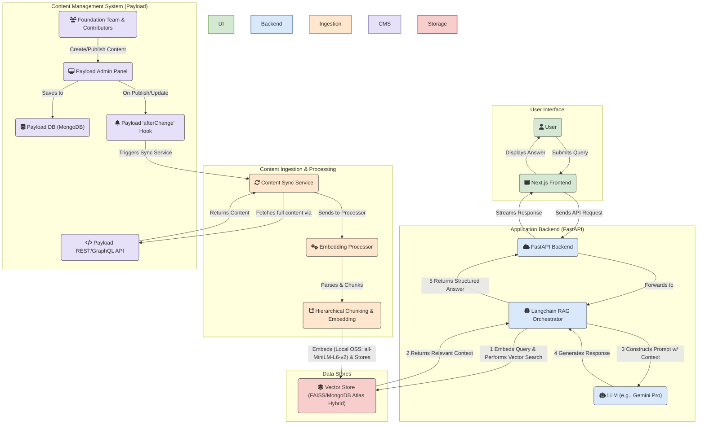

# **Litecoin Knowledge Hub**

## **Project Overview**

The Litecoin Knowledge Hub is an AI-powered conversational tool designed to serve the Litecoin community by providing real-time, accurate answers to a wide range of questions. Its core strength lies in its Retrieval-Augmented Generation (RAG) pipeline, which retrieves information from a human-vetted, curated knowledge base managed by the Litecoin Foundation through **Payload CMS**.

This project's value is not in competing with general-purpose AI models like ChatGPT or Grok, but in providing a specialized, high-accuracy information utility for the Litecoin ecosystem. By grounding responses in a canonical, trusted knowledge base, it aims to combat misinformation, enhance user experience, foster greater adoption, and provide a single, trustworthy source for everything related to Litecoin.

**Target Users/Audience:** Litecoin users (novice and experienced), cryptocurrency enthusiasts, developers building on Litecoin, and potential adopters seeking reliable information.

## **Project Status: 📝 Phase 1 Nearly Complete**

The project has successfully completed the implementation of the core RAG pipeline and backend services, including **conversational memory and history-aware retrieval** that enables natural follow-up conversations. The **Payload CMS integration is now fully operational** with complete content lifecycle management (draft → publish → unpublish → delete) and real-time synchronization. **Comprehensive monitoring infrastructure** (Prometheus, Grafana) and **question logging** have been implemented to track system performance and user queries. The current focus is on populating the CMS with comprehensive Litecoin knowledge base content and preparing for MVP testing and deployment.

## **Key Features & User Stories**

* **Primary Goals:**  
  * Deliver accurate, real-time responses to Litecoin-related queries.  
  * Simplify user access to Litecoin information, reducing reliance on fragmented or unverified sources.  
  * Increase user engagement and trust in the Litecoin ecosystem through reliable, conversational support.

| Feature Area | Description |
| :---- | :---- |
| **Conversational Memory** | ✅ **IMPLEMENTED** - Enables natural follow-up conversations with context-aware responses, allowing users to ask questions like "Who created it?" or "What about the second one?" that reference previous conversation context. |
| **Payload CMS Integration** | ✅ **IMPLEMENTED** - Complete content lifecycle management system with draft→publish→unpublish→delete workflows, real-time webhook synchronization, automated content filtering, and Foundation-controlled editorial oversight ensuring knowledge base quality and accuracy. |
| **Monitoring & Observability** | ✅ **IMPLEMENTED** - Comprehensive monitoring infrastructure with Prometheus metrics, Grafana dashboards, health checks, structured logging, and LLM observability (LangSmith integration). Tracks RAG pipeline performance, LLM costs, cache performance, and system health. |
| **Question Logging** | ✅ **IMPLEMENTED** - All user questions are logged to MongoDB for analysis, enabling insights into user needs, query patterns, and system usage. Includes API endpoints for querying logged questions and statistics. |
| **Litecoin Basics & FAQ** | 📝 **IN PROGRESS** - Provides clear, concise answers to fundamental questions about Litecoin, its history, how it works, and common terminology. Caters especially to new users. Content population in progress. |
| **Transaction & Block Explorer** | 📝 **PLANNED** - Allows users to look up details of Litecoin transactions and explore block information. |
| **Market Data & Insights** | 📝 **PLANNED** - Delivers real-time Litecoin price information, market capitalization, and trading volume from reliable market APIs. |
| **Developer Documentation** | 📝 **PLANNED** - Provides quick access to snippets from Litecoin developer documentation and technical resources. |
| **Curated Knowledge Base** | ✅ **IMPLEMENTED** - A continuously updated library of well-researched articles and data serving as the primary source for the chatbot's answers. Managed through Payload CMS. |

## **Project Roadmap**

### **Phase 1: MVP Core Foundation** 📝 **Nearly Complete**

*The goal of this phase is to launch a functional, reliable chatbot based on a trusted, human-vetted knowledge base managed with professional editorial controls.*

* ✅ **Foundation Editorial Control:** Implemented Payload's role-based system where community contributors create drafts and the Foundation team controls publishing decisions.  
* ✅ **Flexible Content Structuring:** Leveraged Payload's customizable content types (collections) to structure data for optimal RAG performance.  
* ✅ **Real-time Synchronization:** Established afterChange hook-based synchronization between Payload CMS and the RAG pipeline for immediate content updates.  
* ✅ **Monitoring Infrastructure:** Implemented comprehensive monitoring with Prometheus metrics, Grafana dashboards, health checks, and structured logging.  
* ✅ **Question Logging:** Implemented user question logging system for analytics and insights.  
* 📝 **Initial Launch Content:** In progress - Populating Payload CMS with comprehensive Litecoin knowledge base content.  
* 📝 **Production Deployment:** Planned - Deploy the frontend (Next.js), backend (FastAPI), and Payload CMS applications to their respective hosted services.

### **Phase 2: User Experience & Accuracy Enhancements (Post-MVP)**

*The goal of this phase is to increase user trust, engagement, and the precision of the RAG pipeline.*

* **Conversational Memory & Context:** ✅ **COMPLETED** - Implemented history-aware retrieval using LangChain conversational chains to retain conversation history, enabling users to ask natural follow-up questions with context-aware responses.
* **Trust & Transparency (Source Citations):** Implement in-line citations in AI responses, linking directly to source documents.
* **Contextual Discovery (AI-Generated Follow-up Questions):** Generate relevant, clickable follow-up questions after each response.
* **Upgraded Retrieval Engine (Hybrid Search & Re-ranking):** ⚠️ **EVALUATED BUT NOT IMPLEMENTED** - Advanced retrieval techniques (hybrid search combining vector similarity with BM25 keyword search, and cross-encoder re-ranking) were implemented and tested but found to degrade performance without significant accuracy improvements. The current simple vector similarity search provides optimal performance for this use case.
* **User Feedback Loop:** Introduce a mechanism for users to provide direct feedback on AI answer quality.

### **Phase 3: Live Data & Developer Integrations (Post-MVP)**

*The goal of this phase is to expand the chatbot's capabilities by integrating real-time data sources and specialized developer tools.*

* **Transaction & Block Explorer:** Integrate live lookups for Litecoin transactions and blocks.  
* **Market Data & Insights:** Integrate real-time Litecoin price, market cap, and trading volume.  
* **Developer Documentation & Resources:** Ingest and provide quick access to Litecoin developer documentation.

## **Architectural Overview**

The architecture is designed around two primary workflows: **Content Ingestion** (managed via Payload CMS) and **User Query Processing** (the RAG pipeline).



## **Major Milestones & Timelines**

*(Timelines to be determined)*

| Status | Milestone | Focus |
| :---- | :---- | :---- |
| ✅ | [**M1: Project Initialization**](./cline_docs/milestones/milestone_1_project_initialization.md) | Core documentation and project setup. |
| ✅ | [**M2: Basic Project Scaffold**](./cline_docs/milestones/milestone_2_basic_project_scaffold.md) | Initial Next.js frontend and FastAPI backend. |
| ✅ | [**M3: Core RAG Pipeline**](./cline_docs/milestones/milestone_3_core_rag_pipeline.md) | Implemented data ingestion, vector search, and generation. |
| ✅ | [**M4: Litecoin Basics & FAQ**](./cline_docs/milestones/milestone_4_litecoin_basics_faq.md) | CRUD API for data sources and full ingestion of initial FAQ knowledge base. |
| ✅ | [**M5: Payload CMS Setup & Integration**](./cline_docs/milestones/milestone_5_payload_cms_setup_integration.md) | Configure self-hosted Payload CMS and integrate its API and webhooks with the backend. |
| 📝 | [**M6: MVP Content Population**](./cline_docs/milestones/milestone_6_mvp_content_population_validation.md) | Populate Payload with the complete "Litecoin Basics & FAQ" knowledge base. |
| 📝 | [**M7: MVP Testing & Deployment**](./cline_docs/milestones/milestone_7_mvp_testing_refinement_deployment.md) | Conduct comprehensive testing, refine UI, and execute initial production deployment. |
| 📝 | [**M8: Implement Trust & Feedback Features**](./cline_docs/milestones/milestone_8_implement_trust_feedback_features.md) | Implement features from Phase 2 (UX/Accuracy). |
| 📝 | [**M9: Implement Contextual Discovery**](./cline_docs/milestones/milestone_9_implement_contextual_discovery.md) | Implement features from Phase 2 (UX/Accuracy). |
| 📝 | [**M10: Upgrade Retrieval Engine**](./cline_docs/milestones/milestone_10_upgrade_retrieval_engine.md) | Implement features from Phase 2 (UX/Accuracy). |
| 📝 | [**M11: Transaction & Block Explorer**](./cline_docs/milestones/milestone_11_transaction_block_explorer.md) | Implement features from Phase 3 (Live Data). |
| 📝 | [**M12: Market Data & Insights**](./cline_docs/milestones/milestone_12_market_data_insights.md) | Implement features from Phase 3 (Live Data). |
| 📝 | [**M13: Developer Documentation**](./cline_docs/milestones/milestone_13_developer_documentation.md) | Implement features from Phase 3 (Live Data). |

## **Log of Completed Milestones**

* **Monitoring & Observability Infrastructure (Recent)**
  * Implemented comprehensive Prometheus metrics system tracking HTTP requests, RAG pipeline performance, LLM costs, cache performance, and vector store health
  * Set up Grafana dashboards with pre-configured panels for key metrics visualization
  * Added health check endpoints (`/health`, `/health/live`, `/health/ready`) for service monitoring
  * Implemented structured logging with JSON format support for production environments
  * Integrated LangSmith for LLM observability and tracing (optional)
  * Created monitoring middleware for automatic request/response metrics collection
  * Added Docker Compose stack for easy monitoring infrastructure deployment
* **Question Logging System (Recent)**
  * Implemented user question logging to MongoDB for analytics and insights
  * Created API endpoints (`/api/v1/questions`) for querying logged questions with pagination and filtering
  * Added question statistics endpoint for usage analytics
  * Integrated Prometheus metrics for tracking question volume by endpoint type
  * Background logging ensures no performance impact on user queries
* **Payload CMS Content Lifecycle Management (11/3/2025)**
  * Implemented complete CMS content lifecycle with draft→publish→unpublish→delete workflows
  * Added comprehensive webhook support for all content operations (create, update, delete)
  * Enhanced vector store management for content removal and cleanup operations
  * Implemented multi-layer draft content filtering (API, search, vector store)
  * Added manual cleanup endpoints for draft document management
  * Created custom StatusBadge component for visual content status indicators in admin interface
  * Synchronized architectural documentation with Payload CMS integration reality
* **Conversational Memory Implementation (11/3/2025)**
  * Implemented history-aware retriever with standalone question generation using LangChain conversational chains
  * Refactored RAG pipeline to use LCEL conversational chains for improved memory management
  * Enhanced chat history pairing and error handling in backend API
  * Added comprehensive conversational memory tests covering follow-up questions and context resolution
  * Updated frontend message handling for complete exchanges with proper chat history passing
* **Strategic Decision: CMS Pivot to Payload (6/19/2025)**
  * Conducted a comparative analysis of headless CMS options and selected Payload to better align with the project's long-term RAG and data governance goals. This decision enables the work for Milestone 5\.
* **Milestone 4: Backend & Knowledge Base Completion (6/7/2025)**
  * Implemented a full suite of CRUD API endpoints (/api/v1/sources) for managing data sources and successfully ingested the entire initial knowledge base.
* **Milestone 3: Core RAG Pipeline Implementation (6/6/2025)**
  * Implemented and tested the end-to-end pipeline, including multi-source data loaders, local OSS embeddings (sentence-transformers/all-MiniLM-L6-v2), MongoDB Atlas Vector Search / FAISS, and a gemini-pro generation layer. Enhanced pipeline with hierarchical chunking and metadata filtering.
* **Milestone 2: Basic Project Scaffold (6/5/2025)**
  * Frontend (Next.js) and Backend (FastAPI) directory structures established with basic functionality confirmed.
* **Milestone 1: Project Initialization & Documentation Setup (6/5/2025)**
  * Initial project documentation (cline\_docs) created and populated.

## **Technology Stack**

For more details, see cline\_docs/techStack.md.

* **Frontend:** Next.js, TypeScript, Tailwind CSS
* **Backend:** Python, FastAPI, LangChain (LCEL, Conversational Chains, History-Aware Retrieval)
* **AI/LLM:** Gemini Flash 2.0 Lite (for generation)
* **Embeddings:** sentence-transformers/all-MiniLM-L6-v2 (local OSS model via HuggingFace) - Runs locally on CPU/GPU, no API calls required, eliminates rate limits and reduces costs
* **Content Management:** Payload CMS (self-hosted)
* **Database:** MongoDB, MongoDB Atlas Vector Search / FAISS (hybrid for local development)
* **Monitoring:** Prometheus, Grafana, LangSmith (optional LLM tracing)
* **Deployment:** Vercel (Frontend), Railway/Render/Fly.io (Backend), Vercel/Docker (Payload CMS)
  * See [DEPLOYMENT.md](./DEPLOYMENT.md) for detailed deployment instructions
  * See [monitoring/README.md](./monitoring/README.md) for monitoring setup

## **Getting Started**

### **Prerequisites**

* Node.js v18.18.0+
* Python 3.x
* Local MongoDB instance (optional, for document persistence)
* FAISS (automatically installed via pip)

### **Local Development Setup**

#### Vector Store Configuration

For local development, the backend uses FAISS vector store instead of MongoDB Atlas Vector Search. This provides faster setup and doesn't require an Atlas cluster.

1. **Install and Start MongoDB:**
   ```bash
   # Using Homebrew
   brew install mongodb/brew/mongodb-community
   brew services start mongodb-community

   # Or using Docker
   docker run -d --name mongodb -p 27017:27017 mongo:latest
   ```

2. **Configure Environment Variables:**
   Update `backend/.env` with local settings:
   ```env
   # Local MongoDB Connection String
   MONGO_URI="mongodb://localhost:27017"
   FAISS_INDEX_PATH="./backend/faiss_index"

   # Keep other variables (GOOGLE_API_KEY, etc.)
   ```

3. **Data Persistence:**
   - **Documents**: Stored in local MongoDB collections
   - **Embeddings**: Stored in FAISS index files on disk
   - **Index Location**: Configured via `FAISS_INDEX_PATH`

### **Running Development Servers**

1. **Frontend (Next.js):**
   cd frontend
   npm install
   npm run dev
   \# Frontend available at <http://localhost:3000>

2. **Backend (FastAPI):**
   cd backend
   python3 -m venv venv && source venv/bin/activate
   pip install -r requirements.txt
   cp .env.example .env && \# Edit .env with your local credentials
   uvicorn main:app --reload
   \# Backend available at <http://localhost:8000>

   The backend will automatically:
   - Load existing FAISS index if available
   - Create new index from MongoDB documents if needed
   - Save index changes to disk after updates

3. **Payload CMS (Content Management):**
   cd payload_cms
   cp .env.example .env && \# Edit .env with your MongoDB connection string
   pnpm install
   pnpm dev
   \# Payload CMS admin panel available at <http://localhost:3001>

   **Environment Setup:**
   ```env
   # MongoDB connection (use same as backend for local development)
   MONGO_URI="mongodb://localhost:27017/payload_cms"

   # Payload configuration
   PAYLOAD_SECRET="your-secret-key-here"
   PAYLOAD_PUBLIC_SERVER_URL="http://localhost:3001"
   ```

   **Alternative: Docker Setup**
   ```bash
   cd payload_cms
   cp .env.example .env
   # Update MONGO_URI in .env to: mongodb://127.0.0.1/payload_cms
   docker-compose up
   \# Payload CMS available at <http://localhost:3001>
   ```

   **First-Time Setup:**
   - Open http://localhost:3001 in your browser
   - Create your first admin user account
   - Access the admin panel to manage content collections
   - Content published here will automatically sync with the RAG pipeline

### **Staging Environment (Local Production Verification)**

For verifying production builds locally before deployment:

1. **Create `.env.stage` file** in the project root:
   ```bash
   cp .env.stage.example .env.stage
   ```
   
   The example file contains a comprehensive template. At minimum, ensure the URL variables are set for localhost access (they're already configured in the example file).

2. **Run staging environment:**
   ```bash
   # Using helper script (recommended)
   ./scripts/run-stage.sh
   
   # Or manually
   export $(cat .env.stage | xargs) && docker-compose -f docker-compose.prod.yml up --build
   ```

This runs production builds with the full stack (including monitoring) using localhost URLs. See [docs/STAGING.md](./docs/STAGING.md) for detailed documentation.

## **Deployment**

For detailed deployment instructions for all services (Frontend, Backend, and Payload CMS), see [DEPLOYMENT.md](./DEPLOYMENT.md).

## **Contributing**

This project thrives on community contributions to its knowledge base via Payload CMS. The Litecoin Foundation maintains editorial control while enabling community participation. Please contact the Foundation for contributor access.

## **License**

(To be determined \- e.g., MIT License)
