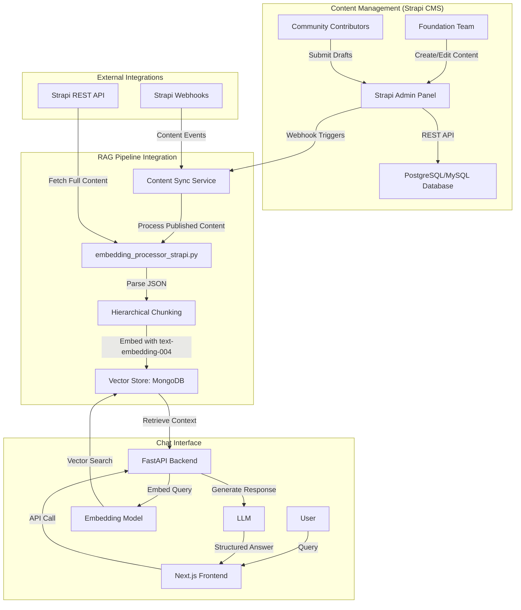

# Litecoin Knowledge Hub

## Project Overview
The Litecoin RAG (Retrieval-Augmented Generation) Chatbot is an AI-powered conversational tool designed to serve the Litecoin community by providing real-time, accurate answers to a wide range of questions. Its core strength lies in retrieving information from a human-vetted, curated knowledge base managed by the Litecoin Foundation through Strapi CMS. This ensures the information is not only accurate but also aligned with the Foundation's mission to combat misinformation and provide a single, trustworthy source for everything related to Litecoin. The chatbot aims to enhance user experience, foster greater adoption, and provide clear, reliable information about Litecoin's features, transaction management, development projects, and market insights.

**Target Users/Audience:** Litecoin users (novice and experienced), Cryptocurrency enthusiasts, Developers building on Litecoin, Potential adopters seeking reliable information about Litecoin's features, transactions, or market trends.

## Project Status
The project has successfully completed:
*   **Core RAG Pipeline Implementation** (Milestone 3).
*   **Backend & Knowledge Base Completion** (Milestone 4).
*   **CMS Strategy Pivot** (Milestone 6).

The project is currently focused on **Milestone 6: Strapi CMS Integration - Phase 1: Strapi Setup and Configuration**.

## Key Features

### Feature 1: Litecoin Basics & FAQ
Provides clear, concise answers to fundamental questions about Litecoin, its history, how it works, and common terminology. Caters especially to new users.

### Feature 2: Transaction & Block Explorer
Allows users to look up details of Litecoin transactions (e.g., status, confirmations, fees) using a transaction ID, and explore block information (e.g., height, timestamp, included transactions).

### Feature 3: Market Data & Insights
Delivers real-time Litecoin price information, market capitalization, trading volume, and basic chart data from reliable market APIs.

### Feature 4: Developer Documentation & Resources
Provides quick access to snippets from Litecoin developer documentation, links to key resources, and answers to common technical questions for developers building on Litecoin.

### Feature 5: Curated Knowledge Base
A continuously updated library of well-researched, clearly written articles and data covering all aspects of Litecoin. This content is explicitly structured for optimal machine retrieval and serves as the primary source for the chatbot's answers.

### Feature 6: Strapi CMS Integration
A robust content management solution leveraging Strapi CMS to ensure the quality, consistency, and accuracy of the Litecoin Knowledge Base. Strapi provides superior database control and content-structuring flexibility, facilitating the creation, editing, and publishing of knowledge base articles with proper editorial workflows.

*   **Primary Goals:**
    *   Leverage Strapi's flexible content types for optimal RAG pipeline compatibility.
    *   Implement foundation-controlled editorial workflows (Contributors create drafts, Foundation team publishes).
    *   Ensure seamless integration with existing RAG pipeline through the Strapi REST API.
    *   Maintain content structure standards for hierarchical chunking.
*   **Current Status:** Planning phase complete. Implementation phase in progress.

## Project Milestones
This project is organized into several key milestones. For detailed information on each milestone, please refer to the documents in the `cline_docs/milestones/` directory.

| Status | Milestone | Description |
| :---: | :--- | :--- |
| ✅ | [Milestone 1: Project Initialization](./cline_docs/milestones/milestone_1_project_initialization.md) | Initial project setup and core documentation. |
| ✅ | [Milestone 2: Basic Project Scaffold](./cline_docs/milestones/milestone_2_basic_project_scaffold.md) | Scaffolding for the Next.js frontend and FastAPI backend. |
| ✅ | [Milestone 3: Core RAG Pipeline](./cline_docs/milestones/milestone_3_core_rag_pipeline.md) | Implementation of the core data ingestion, retrieval, and generation pipeline. |
| ✅ | [Milestone 4: Backend & Knowledge Base Completion](./cline_docs/milestones/milestone_4_litecoin_basics_faq.md) | Full backend and data pipeline for MVP FAQ feature (Feature 1), including full knowledge base ingestion and advanced metadata filtering. |
| 📝 | [Milestone 5: Transaction & Block Explorer](./cline_docs/milestones/milestone_5_transaction_block_explorer.md) | MVP Feature 2: Feature for looking up transaction and block details. |
| 🟨 | [Milestone 6: Strapi CMS Integration](./cline_docs/milestones/milestone_6_ai_integrated_cms.md) | MVP Feature 6: Integration with Strapi CMS. Phase 1 (Setup & Config) 📝. Phase 2 (API Integration) 📝. Phase 3 (Sync Mechanism) 📝. |
| 📝 | [Milestone 7: Developer Documentation & Resources](./cline_docs/milestones/milestone_7_developer_documentation.md) | MVP Feature 4: Feature for providing access to developer resources. |
| 📝 | [Milestone 8: Testing, Refinement & Deployment](./cline_docs/milestones/milestone_8_testing_refinement_deployment.md) | Comprehensive testing, optimization, and deployment of all MVP features. |
| 📝 | [Milestone 9: Market Data & Insights](./cline_docs/milestones/milestone_9_market_data_insights.md) | MVP Feature 3: Feature for delivering real-time Litecoin market data. |

**Legend:**
*   ✅: Completed
*   🟨: In Progress
*   📝: Planned

## Technology Stack

*   **Frontend:**
    *   Framework: Next.js
    *   Styling: Tailwind CSS
    *   Language: TypeScript
*   **Backend:**
    *   Language: Python
    *   Framework: FastAPI
    *   RAG & LLM: Langchain (`langchain`, `langchain-core`, `langchain-community`), Google Text Embedding (`text-embedding-004`), `ChatGoogleGenerativeAI` (gemini-pro)
    *   Database Interaction: MongoDB (`pymongo`, `motor`)
    *   Strapi Integration: Strapi REST API, webhook handling
    *   Data Handling: `python-frontmatter`
    *   Other Key Libraries: `requests`, `tweepy`, `GitPython`, `beautifulsoup4`, `lxml`
*   **Content Management:**
    *   CMS: Strapi (self-hosted)
    *   Database: PostgreSQL/MySQL (Strapi), MongoDB (RAG vectors)
    *   Content Format: JSON
*   **Database:**
    *   Vector Storage: MongoDB Atlas Vector Search
    *   Content Storage: PostgreSQL/MySQL (Strapi CMS)
    *   General Data: MongoDB
*   **Deployment:**
    *   Frontend: Vercel
    *   Backend: TBD (e.g., Vercel Functions, Google Cloud Run, AWS Lambda)
    *   Strapi CMS: Self-hosted (TBD platform)
*   **Testing:**
    *   Frontend: TBD (e.g., Jest, React Testing Library, Cypress)
    *   Backend: TBD (e.g., Pytest)
*   **Version Control:** Git (hosted on GitHub/GitLab - TBD)

For more details, see `cline_docs/techStack.md`.

## Project Structure
*   **Git Repository Root:** `Litecoin-Knowledge-Hub/`
*   `frontend/`: Next.js application.
    *   `src/app/`: Main application routes and pages.
    *   `src/components/`: Reusable React components.
    *   `src/lib/`: Utility libraries and configurations.
*   `backend/`: FastAPI application.
    *   `cms/`: Contains the self-hosted Strapi CMS application. This is the content authoring and management system.
    *   `strapi/`: Strapi CMS integration modules.
    *   `data_ingestion/`: Modules for data loading, embedding, vector store management.
    *   `api/v1/`: API version 1 routers (chat, sources, sync).
    *   `main.py`: Main FastAPI application.
    *   `rag_pipeline.py`: Core RAG logic.
    *   `embedding_processor_strapi.py`: Strapi-specific content processing.
*   `knowledge_base/`: Legacy curated Markdown articles (to be migrated to Strapi).
*   `cline_docs/`: Project documentation.
*   `cline_agent_workspace/`: Cline's operational files.
*   `user_instructions/`: User-facing guides.
*   `reference_docs/`: Third-party documentation.

For a detailed overview, see `cline_docs/codebaseSummary.md`.

## Architecture Overview

The project utilizes a Next.js frontend, Python/FastAPI backend, and Strapi CMS for content management. The architecture is centered around a **content-first RAG pipeline** with Strapi CMS serving as the authoritative content source.



## Content-First Approach with Strapi CMS
This project emphasizes a **content-first strategy** powered by Strapi CMS. The accuracy and reliability of the chatbot are directly tied to the quality of the information managed through Strapi's editorial workflow. Strapi CMS provides:

*   **Foundation-controlled editorial workflow**: Contributors create drafts, Foundation team reviews and publishes.
*   **Flexible Content Types**: Customizable content structures are ideal for RAG.
*   **Robust REST API**: Comprehensive access to content and metadata.
*   **Webhook system**: Real-time synchronization with the RAG pipeline.
*   **Professional Admin Panel**: A powerful interface for content management.

The Strapi CMS serves as the "golden source" for the RAG pipeline, providing greater data control and flexibility.

## Getting Started

### Prerequisites
*   **Node.js:** Version 18.18.0 or newer (managed via nvm is recommended).
*   **npm:** Node package manager (comes with Node.js).
*   **Python:** Version 3.x.
*   **pip:** Python package installer (comes with Python).
*   **Virtual Environment:** Recommended for Python projects.
*   **Strapi CMS:** Self-hosted Strapi instance with REST API access.
*   **PostgreSQL/MySQL:** Database for Strapi CMS.

### Running Development Servers

#### Frontend (Next.js)

1.  **Navigate to the frontend directory:**
    ```bash
    cd frontend
    ```

2.  **Run the development server:**
    ```bash
    npm run dev
    ```
    The Next.js development server should start, typically on `http://localhost:3000`.

3.  **Verify:**
    Open your web browser and go to `http://localhost:3000`. You should see the Litecoin RAG Chat interface.

#### Backend (FastAPI)

1.  **Navigate to the backend directory:**
    ```bash
    cd backend
    ```

2.  **Create a virtual environment (recommended):**
    ```bash
    python3 -m venv venv
    source venv/bin/activate  # On macOS/Linux
    # .\venv\Scripts\activate  # On Windows
    ```

3.  **Install dependencies:**
    ```bash
    pip install -r requirements.txt
    ```

4.  **Set up environment variables:**
    ```bash
    cp .env.example .env
    # Edit .env with your Strapi API URL, tokens, and other credentials
    ```

5.  **Run the development server:**
    ```bash
    uvicorn main:app --reload
    ```
    The FastAPI development server should start, typically on `http://localhost:8000`.

### Strapi CMS Setup

1.  **Install Strapi CMS** following the official documentation.
2.  **Configure API Tokens** in Strapi Admin → Settings → API Tokens.
3.  **Set up webhooks** for content synchronization with the RAG pipeline.
4.  **Configure user roles** (Contributors for community, Editors/Admins for Foundation).

### Running Data Ingestion from Strapi

1.  **Navigate to the backend directory:**
    ```bash
    cd backend
    ```

2.  **Run Strapi content ingestion (example):**
    ```bash
    python ingest_strapi_content.py --api_url http://localhost:1337 --api_token your_api_token
    ```

3.  **Verify:**
    Confirm content is processed and vectors are stored in MongoDB Atlas.

## Security Considerations
*   Input validation for all user queries and API inputs.
*   Protection against common web vulnerabilities (OWASP Top 10).
*   Secure handling of API keys and credentials (not hardcoded).
*   Strapi CMS authentication and authorization for content management.
*   Webhook security for Strapi-to-RAG synchronization.

## Documentation
The project's core documentation is maintained in the `cline_docs/` directory:
*   `projectRoadmap.md`: High-level project vision, goals, architecture, and major milestones.
*   `currentTask.md`: Details active tasks, backlog, progress, and immediate development plan.
*   `techStack.md`: Documents all technology choices, frameworks, tools, and their rationale.
*   `codebaseSummary.md`: Provides an overview of the project's structure, key components, data flow, and dependencies.

## Contributing
This project thrives on community contributions to its knowledge base through Strapi CMS. The Litecoin Foundation maintains editorial control while enabling community participation.

### Content Contribution Process
1.  **Request Contributor Access**: Contact the Litecoin Foundation for Strapi CMS contributor credentials.
2.  **Create Draft Content**: Use Strapi's rich text editor to create well-structured articles.
3.  **Foundation Review**: The Foundation team reviews and publishes approved content.
4.  **Automatic Sync**: Published content automatically updates the RAG pipeline.

For detailed guidelines on content structure and submission, see the Strapi CMS editorial guidelines (to be provided by Foundation team).

## License
(To be determined - e.g., MIT License)
