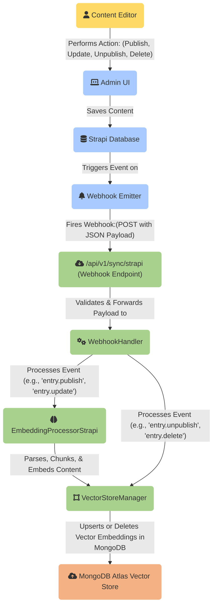

# Strapi CMS Integration Diagram (Webhook-Only CRUD)

This document provides a detailed architectural diagram of how the Strapi CMS is integrated into the RAG (Retrieval-Augmented Generation) pipeline, using a webhook-only model for all data synchronization (CRUD operations).

### Diagram Explanation:

This diagram illustrates a purely event-driven architecture for synchronizing content between Strapi CMS and the RAG pipeline's vector store. All Create, Read, Update, and Delete (CRUD) operations are handled in real-time via webhooks.

**Real-Time CRUD Synchronization Flow (Steps 1-6):**

1.  **Action in CMS**: The entire process begins when a content editor performs an action in the **Strapi Admin UI**, such as publishing a new article (**Create**), modifying an existing one (**Update**), or unpublishing/deleting an article (**Delete**).
2.  **Webhook Event**: Strapi's **Webhook Emitter** detects the change and sends a POST request with a JSON payload to the FastAPI backend's `/api/v1/sync/strapi` endpoint. The payload contains details about the event (`entry.publish`, `entry.update`, `entry.unpublish`, `entry.delete`) and the content entry itself.
3.  **Webhook Handling**: The `WebhookHandler` in the backend receives and validates the payload.
4.  **Event Routing**:
    *   For **Create/Update** events (`entry.publish`, `entry.update`), the handler passes the content to the `EmbeddingProcessorStrapi`.
    *   For **Delete** events (`entry.unpublish`, `entry.delete`), the handler directly instructs the `VectorStoreManager` to remove the content.
5.  **Processing & Embedding**: For create/update events, the `EmbeddingProcessorStrapi` parses the rich text JSON, performs hierarchical chunking, and generates vector embeddings.
6.  **Database Operation**: The `VectorStoreManager` performs the final action on the **MongoDB Atlas Vector Store**:
    *   It **upserts** (updates or inserts) the new vector embeddings for create/update events.
    *   It **deletes** the corresponding vector embeddings for delete events.

This streamlined, webhook-only architecture ensures that the vector store is always an exact, real-time reflection of the published content in Strapi, making the system highly reliable and efficient.
