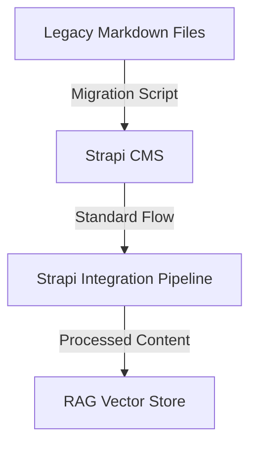

# Codebase Summary: Litecoin RAG Chat

## High-Level Directory Structure Overview
*   **Git Repository Root:** `Litecoin-Knowledge-Hub/` (This is the root of the monorepo and the Git repository.)
*   `.gitignore`: Specifies intentionally untracked files that Git should ignore for both frontend and backend, with rules correctly scoped for the monorepo structure.
*   `frontend/`: Contains the Next.js application.
    *   `src/`: Main source code for the Next.js application (using App Router).
        *   `app/`: Application routes and pages.
            *   `page.tsx`: Main chat interface.
            *   `login/page.tsx`: Authentication page.
        *   `components/`: Reusable React components for the chat interface.
        *   `contexts/`: React contexts for state management.
        *   `lib/`: Utility libraries and configurations.
*   `backend/`: Contains the FastAPI application.
    *   `cms/`: Contains the self-hosted Strapi CMS application. This is the content authoring and management system.
    *   `strapi/`: Directory for Strapi CMS integration modules.
        *   `client.py`: Strapi REST API client implementation.
        *   `webhook_handler.py`: Strapi webhook processing logic.
    *   `data_ingestion/`: Contains modules for data loading, embedding, and vector store management.
        *   `embedding_processor_strapi.py`: Strapi-specific content processor for JSON parsing and hierarchical chunking.
    *   `api/v1/`: API version 1 routers.
        *   `chat.py`: Chat endpoint for RAG queries.
        *   `sources.py`: Data source management endpoints.
        *   `sync/`: Synchronization endpoints.
            *   `strapi.py`: Strapi webhook endpoints for content synchronization.
    *   `utils/`: Contains utility scripts.
    *   `main.py`: Main FastAPI application file.
    *   `rag_pipeline.py`: Encapsulates Langchain-related logic for the RAG pipeline.
*   `cline_docs/`: Contains project documentation.
    *   `projectRoadmap.md`: High-level project vision, goals, and progress.
    *   `currentTask.md`: Details of current objectives and active tasks.
    *   `techStack.md`: Key technology choices and justifications.
    *   `codebaseSummary.md`: Overview of project structure and components.
    *   `task_archive.md`: Archive of completed tasks.
*   `knowledge_base/`
    *   `articles/`: Subdirectory containing the curated markdown articles.
    *   `_template.md`: Template for knowledge base articles.
    *   `index.md`: Master index of all knowledge base articles.
    *   `deep_research/`: Subdirectory for deep research articles.
*   `cline_agent_workspace/`: Contains agent's operational files.
*   `reference_docs/`: Contains documentation for frameworks, services, and APIs used in the project.
*   `user_instructions/`: Contains instructions for the user.

## Key Modules/Components & Their Responsibilities

### Core RAG Pipeline Components
*   `backend/rag_pipeline.py`: Contains the core logic for the RAG (Retrieval-Augmented Generation) pipeline. This includes orchestrating Langchain chains, using an updated prompt template, and ensuring user queries are embedded with `task_type='retrieval_query'`.
*   `backend/main.py`: The main entry point for the FastAPI backend, responsible for defining API endpoints and handling incoming requests.
*   `backend/data_ingestion/embedding_processor.py`: Handles hierarchical chunking of Markdown documents (prepending titles/sections to content) and standard text splitting for other formats. Generates vector embeddings using Google Text Embedding 004 with `task_type='retrieval_document'` for knowledge base content.
*   `backend/data_ingestion/vector_store_manager.py`: Manages connections to MongoDB Atlas. Facilitates the insertion and retrieval of vector embeddings. Handles deletion of documents based on flattened metadata fields.

### Strapi CMS Application
*   `backend/cms/`: The self-hosted Strapi application. It provides the admin UI for content creation, role-based access control, and the API endpoints for the frontend and RAG pipeline to consume.

### Strapi CMS Integration Components
*   `backend/strapi/client.py`: **(Implemented)** Strapi REST API client for fetching content collections, handling authentication, and managing API requests.
*   `backend/strapi/webhook_handler.py`: **(Implemented)** Processes Strapi webhook events (e.g., entry.publish, entry.unpublish) and triggers the appropriate RAG pipeline updates.
*   `backend/strapi/rich_text_chunker.py`: **(Enhanced)** This module now implements a sophisticated, stateful algorithm to perform hierarchical chunking of Strapi's rich text JSON. It creates structured documents based on heading levels, prepends hierarchical context to the content, and generates rich metadata for each chunk.
*   `backend/strapi/webhook_handler.py`: **(Updated)** The webhook handler now directly uses the `StrapiRichTextChunker` to process incoming article content, ensuring that all published and updated articles are correctly chunked before being sent to the vector store.
*   `backend/data_ingestion/embedding_processor_strapi.py`: **(Updated)** This processor's core chunking responsibility has been superseded by the webhook handler's direct use of the chunker. It remains as a potential tool for manual or bulk ingestion.
*   `backend/api/v1/sync/strapi.py`: **(Implemented)** FastAPI router containing the Strapi webhook endpoint for real-time content synchronization.

### Legacy Components (To be Modified/Removed)
*   `backend/data_ingestion/litecoin_docs_loader.py`: Legacy loader for Markdown files. Will be used by the migration script but deprecated for direct ingestion.

### Utility and Support Components
*   `backend/ingest_data.py`: **(Updated)** A standalone script to orchestrate the data ingestion process, now supporting Strapi as a content source.
*   `backend/utils/clear_litecoin_docs_collection.py`: A utility script to clear all documents from collections in MongoDB.
*   `backend/data_models.py`: **(Updated)** Contains core Pydantic data models for the application, now including models for Strapi integration.
*   `backend/api/v1/sources.py`: Contains the API router and CRUD endpoints for managing data sources, to be updated to include Strapi as a source type.

## Core Data Models & Entities
*   **`DataSource`**: A Pydantic model representing a data source for the RAG pipeline. To be updated to include Strapi as a source type.
*   **`StrapiArticle`**: New Pydantic model representing a Strapi content type with all relevant metadata fields.
*   **`StrapiWebhookPayload`**: Model for handling Strapi webhook payloads with event type and entry data.

## Critical Data Flow Diagrams

### Strapi CMS Integration Data Flow
```mermaid
graph TD
    A[Strapi CMS] -- "Publish/Update Event" -->|Webhook| B(FastAPI Backend)
    
    subgraph B
        C[Webhook Handler] --> D[Strapi Rich Text Chunker]
        D -- "Creates structured chunks" --> E[Multiple Documents w/ Hierarchical Metadata]
    end

    E -- "Enriched with base metadata" --> F(Vector Embeddings)
    H --> I[MongoDB Vector Store]

    J[User Query] --> K[RAG Pipeline]
    K -->|Vector Search w/ Metadata Filter| I
    I -->|Retrieved Chunks| K
    K --> L[Generated Answer]
    L --> M[User Response]
```

### Legacy Knowledge Base Integration Flow (for reference)


## API Endpoints Overview

### Chat & Core Functionality
*   **`POST /api/v1/chat`**:
    *   **Description**: Receives a user query and processes it through the RAG pipeline, incorporating conversational history for context-aware responses.
    *   **Request Body**: `{"query": "string", "chat_history": [{"role": "human" | "ai", "content": "string"}]}`
    *   **Response Body**: `{"answer": "string", "sources": [...]}`

### Data Source Management
*   **`POST /api/v1/sources`**: Creates a new data source record (to be updated for Strapi support).
*   **`GET /api/v1/sources`**:
