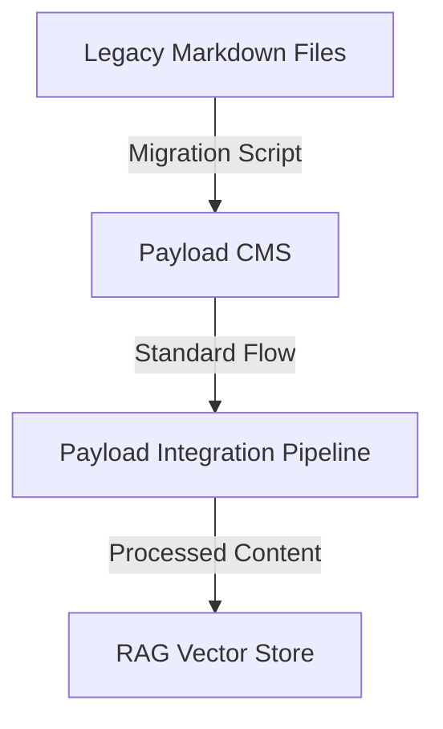

# Codebase Summary: Litecoin RAG Chat

## High-Level Directory Structure Overview
*   **Git Repository Root:** `Litecoin-Knowledge-Hub/` (This is the root of the monorepo and the Git repository.)
*   `.gitignore`: Specifies intentionally untracked files that Git should ignore for both frontend and backend, with rules correctly scoped for the monorepo structure.
*   `frontend/`: Contains the Next.js application.
    *   `src/`: Main source code for the Next.js application (using App Router).
        *   `app/`: Application routes and pages.
            *   `page.tsx`: Main chat interface.
            *   `login/page.tsx`: Authentication page.
        *   `components/`: Reusable React components for the chat interface.
        *   `contexts/`: React contexts for state management.
        *   `lib/`: Utility libraries and configurations.
*   `backend/`: Contains the FastAPI application.
    *   `payload-cms/`: (New) Contains the self-hosted Payload CMS application. This is the content authoring and management system.
    *   `payload_integration/`: (New) Directory for Payload CMS integration modules.
        *   `client.py`: Payload REST/GraphQL API client implementation.
        *   `webhook_handler.py`: Payload `afterChange` hook processing logic (conceptual, actual implementation might be within Payload itself or a dedicated service).
    *   `data_ingestion/`: Contains modules for data loading, embedding, and vector store management.
        *   `embedding_processor.py`: (Adapted) Handles content processing for hierarchical chunking and embedding, now adapted for Payload content.
    *   `api/v1/`: API version 1 routers.
        *   `chat.py`: Chat endpoint for RAG queries.
        *   `sources.py`: Data source management endpoints.
        *   `sync/`: Synchronization endpoints.
            *   `payload.py`: (New) Payload `afterChange` hook endpoints for content synchronization.
    *   `utils/`: Contains utility scripts.
    *   `main.py`: Main FastAPI application file.
    *   `rag_pipeline.py`: Encapsulates Langchain-related logic for the RAG pipeline.
*   `cline_docs/`: Contains project documentation.
    *   `projectRoadmap.md`: High-level project vision, goals, and progress.
    *   `currentTask.md`: Details of current objectives and active tasks.
    *   `techStack.md`: Key technology choices and justifications.
    *   `codebaseSummary.md`: Overview of project structure and components.
    *   `task_archive.md`: Archive of completed tasks.
*   `knowledge_base/`
    *   `articles/`: Subdirectory containing the curated markdown articles.
    *   `_template.md`: Template for knowledge base articles.
    *   `index.md`: Master index of all knowledge base articles.
    *   `deep_research/`: Subdirectory for deep research articles.
*   `cline_agent_workspace/`: Contains agent's operational files.
*   `reference_docs/`: Contains documentation for frameworks, services, and APIs used in the project.
*   `user_instructions/`: Contains instructions for the user.

## Key Modules/Components & Their Responsibilities

### Core RAG Pipeline Components
*   `backend/rag_pipeline.py`: Contains the core logic for the RAG (Retrieval-Augmented Generation) pipeline. This includes orchestrating Langchain chains, using an updated prompt template, and ensuring user queries are embedded with `task_type='retrieval_query'`.
*   `backend/main.py`: The main entry point for the FastAPI backend, responsible for defining API endpoints and handling incoming requests.
*   `backend/data_ingestion/embedding_processor.py`: Handles hierarchical chunking of Markdown documents (prepending titles/sections to content) and standard text splitting for other formats. Generates vector embeddings using Google Text Embedding 004 with `task_type='retrieval_document'` for knowledge base content.
*   `backend/data_ingestion/vector_store_manager.py`: Manages connections to MongoDB Atlas. Facilitates the insertion and retrieval of vector embeddings. Handles deletion of documents based on flattened metadata fields.

### Payload CMS Application
*   `backend/payload-cms/`: The self-hosted Payload application. It provides the admin UI for content creation, role-based access control, and the API endpoints for the frontend and RAG pipeline to consume.

### Payload CMS Integration Components
*   `backend/payload_integration/client.py`: **(New)** Payload REST/GraphQL API client for fetching content collections, handling authentication, and managing API requests.
*   `backend/payload_integration/webhook_handler.py`: **(Conceptual)** Processes Payload `afterChange` events and triggers the appropriate RAG pipeline updates. This logic might be integrated directly into Payload's custom server or a separate microservice.
*   `backend/data_ingestion/embedding_processor.py`: **(Adapted)** This module will be adapted to process Payload's rich text JSON content. It will implement a sophisticated, stateful algorithm to perform hierarchical chunking, create structured documents based on heading levels, prepend hierarchical context to the content, and generate rich metadata for each chunk.
*   `backend/data_ingestion/vector_store_manager.py`: **(Enhanced)** Will be updated to include methods for robust deletion and updating of Payload entries based on their stable IDs.
*   `backend/api/v1/sync/payload.py`: **(New)** FastAPI router containing the Payload `afterChange` hook endpoint for real-time content synchronization.

### Legacy Components (To be Modified/Removed)
*   `backend/cms/`: (To be removed) The old Strapi CMS directory.
*   `backend/strapi/`: (To be removed) Directory for Strapi CMS integration modules.
*   `backend/data_ingestion/embedding_processor_strapi.py`: (To be removed/refactored) Strapi-specific content processor.
*   `backend/api/v1/sync/strapi.py`: (To be removed) Strapi webhook endpoints.
*   `backend/debug_strapi_client.py`: (To be removed) Debugging script for Strapi.
*   `backend/test_strapi_webhook.py`: (To be removed) Test script for Strapi webhook.
*   `backend/data_ingestion/litecoin_docs_loader.py`: Legacy loader for Markdown files. Will be used by the migration script but deprecated for direct ingestion.

### Utility and Support Components
*   `backend/ingest_data.py`: **(Updated)** A standalone script to orchestrate the data ingestion process, now supporting Payload as a content source.
*   `backend/utils/clear_litecoin_docs_collection.py`: A utility script to clear all documents from collections in MongoDB.
*   `backend/data_models.py`: **(Updated)** Contains core Pydantic data models for the application, now including models for Payload integration.
*   `backend/api/v1/sources.py`: Contains the API router and CRUD endpoints for managing data sources, to be updated to include Payload as a source type.

## Core Data Models & Entities
*   **`DataSource`**: A Pydantic model representing a data source for the RAG pipeline. To be updated to include Payload as a source type.
*   **`PayloadArticle`**: New Pydantic model representing a Payload content type (collection) with all relevant metadata fields.
*   **`PayloadAfterChangePayload`**: Model for handling Payload `afterChange` hook payloads with event type and entry data.

## Critical Data Flow Diagrams

### Payload CMS Integration Data Flow
```mermaid
graph TD
    A[Payload CMS] -- "Publish/Update Event" -->|`afterChange` Hook| B(FastAPI Backend)
    
    subgraph B
        C[Payload Integration Service] --> D[Embedding Processor (Adapted)]
        D -- "Creates structured chunks" --> E[Multiple Documents w/ Hierarchical Metadata]
    end

    E -- "Enriched with base metadata" --> F(Vector Embeddings)
    F --> I[MongoDB Vector Store]

    J[User Query] --> K[RAG Pipeline]
    K -->|Vector Search w/ Metadata Filter| I
    I -->|Retrieved Chunks| K
    K --> L[Generated Answer]
    L --> M[User Response]
```

### Legacy Knowledge Base Integration Flow (for reference)


## API Endpoints Overview

### Chat & Core Functionality
*   **`POST /api/v1/chat`**:
    *   **Description**: Receives a user query and processes it through the RAG pipeline, incorporating conversational history for context-aware responses.
    *   **Request Body**: `{"query": "string", "chat_history": [{"role": "human" | "ai", "content": "string"}]}`
    *   **Response Body**: `{"answer": "string", "sources": [...]}`

### Data Source Management
*   **`POST /api/v1/sources`**: Creates a new data source record (to be updated for Payload support).
*   **`GET /api/v1/sources`**:
