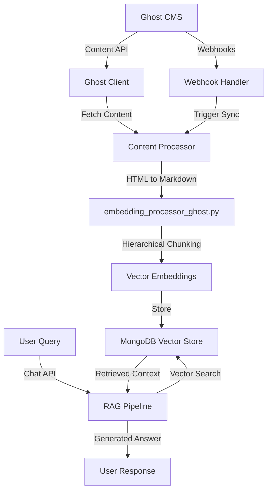
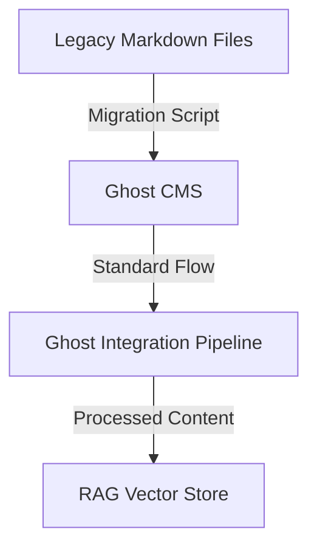

# Codebase Summary: Litecoin RAG Chat

## High-Level Directory Structure Overview
*   **Git Repository Root:** `Litecoin-RAG-Chat/` (This is the root of the monorepo and the Git repository.)
*   `.gitignore`: Specifies intentionally untracked files that Git should ignore for both frontend and backend, with rules correctly scoped for the monorepo structure.
*   `frontend/`: Contains the Next.js application.
    *   `src/`: Main source code for the Next.js application (using App Router).
        *   `app/`: Application routes and pages.
            *   `page.tsx`: Main chat interface.
            *   `login/page.tsx`: Authentication page (may be deprecated with Ghost integration).
        *   `components/`: Reusable React components for the chat interface.
        *   `contexts/`: React contexts for state management.
        *   `lib/`: Utility libraries and configurations.
*   `backend/`: Contains the FastAPI application.
    *   `ghost_integration/`: New directory for Ghost CMS integration modules.
        *   `client.py`: Ghost Content API client implementation.
        *   `webhook_handlers.py`: Ghost webhook processing logic.
        *   `content_processor.py`: Ghost content processing and synchronization.
    *   `data_ingestion/`: Contains modules for data loading, embedding, and vector store management.
        *   `embedding_processor_ghost.py`: New Ghost-specific content processor for HTML-to-Markdown conversion and hierarchical chunking.
    *   `api/v1/`: API version 1 routers.
        *   `chat.py`: Chat endpoint for RAG queries.
        *   `sources.py`: Data source management endpoints.
        *   `sync/`: Synchronization endpoints.
            *   `ghost.py`: Ghost webhook endpoints for content synchronization.
    *   `utils/`: Contains utility scripts.
    *   `main.py`: Main FastAPI application file.
    *   `rag_pipeline.py`: Encapsulates Langchain-related logic for the RAG pipeline.
*   `cline_docs/`: Contains project documentation.
    *   `projectRoadmap.md`: High-level project vision, goals, and progress.
    *   `currentTask.md`: Details of current objectives and active tasks.
    *   `techStack.md`: Key technology choices and justifications.
    *   `codebaseSummary.md`: Overview of project structure and components.
    *   `task_archive.md`: Archive of completed tasks.
*   `knowledge_base/`: Contains the legacy curated knowledge base (to be migrated to Ghost CMS).
    *   `articles/`: Subdirectory containing the curated markdown articles.
    *   `_template.md`: Template for knowledge base articles (reference for Ghost content structure).
    *   `index.md`: Master index of all knowledge base articles.
    *   `deep_research/`: Subdirectory for deep research articles.
*   `ghost_cms/`: New directory for Ghost CMS related configurations and scripts.
    *   `migration/`: Scripts for migrating legacy content to Ghost.
    *   `config/`: Ghost CMS configuration files and templates.
    *   `backups/`: Ghost content backups and exports.
*   `cline_agent_workspace/`: Contains agent's operational files.
*   `reference_docs/`: Contains documentation for frameworks, services, and APIs used in the project.
*   `user_instructions/`: Contains instructions for the user.

## Key Modules/Components & Their Responsibilities

### Core RAG Pipeline Components
*   `backend/rag_pipeline.py`: Contains the core logic for the RAG (Retrieval-Augmented Generation) pipeline. This includes orchestrating Langchain chains, using an updated prompt template, and ensuring user queries are embedded with `task_type='retrieval_query'`.
*   `backend/main.py`: The main entry point for the FastAPI backend, responsible for defining API endpoints and handling incoming requests.
*   `backend/data_ingestion/embedding_processor.py`: Handles hierarchical chunking of Markdown documents (prepending titles/sections to content) and standard text splitting for other formats. Generates vector embeddings using Google Text Embedding 004 with `task_type='retrieval_document'` for knowledge base content.
*   `backend/data_ingestion/vector_store_manager.py`: Manages connections to MongoDB Atlas. Facilitates the insertion and retrieval of vector embeddings. Handles deletion of documents based on flattened metadata fields.

### Ghost CMS Integration Components
*   `backend/ghost_integration/client.py`: Ghost Content API client for fetching posts, metadata, and managing authentication. Provides methods for browsing posts, reading individual articles, and handling pagination.
*   `backend/ghost_integration/webhook_handlers.py`: Processes Ghost webhook events (post.published, post.updated, post.deleted) and triggers appropriate RAG pipeline updates.
*   `backend/ghost_integration/content_processor.py`: Orchestrates the Ghost content processing workflow, including API calls, content transformation, and vector store updates.
*   `backend/data_ingestion/embedding_processor_ghost.py`: Specialized processor for Ghost content that converts HTML to Markdown, performs hierarchical chunking, and maps Ghost metadata to RAG pipeline metadata schema.
*   `backend/api/v1/sync/ghost.py`: FastAPI router containing Ghost webhook endpoints for real-time content synchronization with the RAG pipeline.

### Legacy Components (Deprecated/Modified)
*   `backend/data_ingestion/litecoin_docs_loader.py`: Legacy loader for Markdown files. Still used for non-Ghost content sources but primary content now comes from Ghost CMS.
*   `backend/cms/`: Directory containing deprecated custom CMS implementation that has been replaced by Ghost CMS integration.

### Utility and Support Components
*   `backend/ingest_data.py`: A standalone script to orchestrate the data ingestion process, now updated to support Ghost CMS as a content source.
*   `backend/utils/clear_litecoin_docs_collection.py`: A utility script to clear all documents from collections in MongoDB.
*   `backend/data_models.py`: Contains core Pydantic data models for the application, including new models for Ghost integration.
*   `backend/api/v1/sources.py`: Contains the API router and CRUD endpoints for managing data sources, updated to include Ghost CMS as a source type.

## Core Data Models & Entities
*   **`DataSource`**: A Pydantic model representing a data source for the RAG pipeline. Updated to include Ghost CMS as a source type.
*   **`GhostPost`**: New Pydantic model representing a Ghost CMS post with all relevant metadata fields.
*   **`GhostWebhookPayload`**: Model for handling Ghost webhook payloads with event type and post data.
*   **`ContentSyncEvent`**: Model for tracking synchronization events between Ghost CMS and RAG pipeline.

## Critical Data Flow Diagrams

### Ghost CMS Integration Data Flow

### Legacy Knowledge Base Integration Flow (for reference)

## API Endpoints Overview

### Chat & Core Functionality
*   **`POST /api/v1/chat`**:
    *   **Description**: Receives a user query and processes it through the RAG pipeline, incorporating conversational history for context-aware responses.
    *   **Request Body**: `{"query": "string", "chat_history": [{"role": "human" | "ai", "content": "string"}]}`
    *   **Response Body**: `{"answer": "string", "sources": [...]}`

### Data Source Management
*   **`POST /api/v1/sources`**: Creates a new data source record (now includes Ghost CMS support).
*   **`GET /api/v1/sources`**: