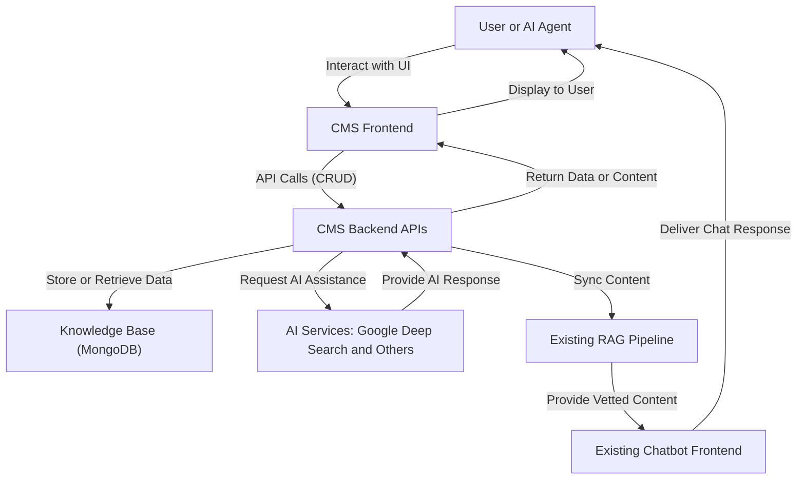

# Milestone 6: AI-Integrated Knowledge Base CMS Development

## Description
A foundational component of the content strategy, this Content Management System (CMS) is designed to ensure the quality, consistency, and accuracy of the Litecoin Knowledge Base. It will facilitate the creation, editing, vetting, publishing, and archiving of knowledge base articles, integrating AI assistance to streamline workflows.

## Primary Goals
*   **Enforce Content Structure:** Ensure all articles strictly adhere to the predefined template (`knowledge_base/_template.md`), including frontmatter and body structure, critical for the RAG pipeline's hierarchical chunking.
*   **Streamline Content Creation:** Provide a user-friendly and efficient editor (Tiptap with React Hook Form) for human and AI content creators.
*   **Ensure Data Integrity:** Use schema-driven validation (Zod) to guarantee content is well-formed before saving.
*   **Seamless Integration:** Integrate smoothly into the Next.js frontend and produce Markdown output compatible with the backend ingestion pipeline.

## CMS Architecture

## Phases & Key Tasks

### Phase 1: Core Setup & Basic Content Management (`CMS-IMP-001`) - ✅ Completed
*   **Goal:** Establish foundational elements for article creation, editing, and management.
*   **Tasks:**
    *   Develop backend structure (FastAPI) with domain-driven modules (`/cms`).
    *   Implement Pydantic models and CRUD APIs (`/api/v1/articles`).
    *   Set up initial JWT authentication with basic roles.
    *   On the frontend (Next.js), install dependencies (Tiptap, React Hook Form, Zod, ShadCN).
    *   Create Zod schemas for article validation.
    *   Build core components (`FrontmatterForm.tsx`, `TiptapEditor.tsx`) and pages for the CMS.
*   **Status:** Completed (6/9/2025)
*   **Notes on Completion:**
    *   Core Setup: Integrated selected frontend technologies (Tiptap, React Hook Form with Zod, ShadCN) into the Next.js application.
    *   Basic Article CRUD: Developed basic article CRUD API endpoints (`/api/v1/articles`) in the FastAPI backend, capable of creating, reading, updating, and deleting article data in MongoDB. Frontend components for article creation/editing (including frontmatter form and Tiptap editor) were developed and connected to the backend API.
    *   Initial Authentication: Implemented initial JWT-based authentication for CMS access, including login and registration endpoints.
    *   Basic User Roles: Defined basic user roles (e.g., Writer, Editor) for core CMS actions.

### Phase 2: Semantic Search & RAG Synchronization (`CMS-IMP-002`) - ✅ Completed
*   **Goal:** Enhance CMS usability and connect it to the live RAG pipeline.
*   **Tasks:**
    *   Implement a semantic search API and UI for internal CMS use.
    *   Establish a robust synchronization mechanism (e.g., webhook) to update the RAG pipeline's vector store in real-time as content is vetted, updated, or archived in the CMS.
*   **Status:** Completed (6/11/2025)
*   **Notes on Completion:**
    *   Backend:
        *   Created `/api/v1/articles/search` endpoint for semantic search within CMS articles.
        *   Integrated content embedding into article save/update logic in `crud.py` for the search index.
        *   Implemented `/api/v1/sync/rag` webhook for RAG pipeline synchronization.
        *   The `update_article` function in `crud.py` now calls this webhook on relevant `vetting_status` changes (e.g., to "vetted", or when a "vetted" article is updated/archived).
        *   The webhook logic in `sync/router.py` handles adding/deleting documents from the RAG vector store (`litecoin_docs` collection) using `VectorStoreManager`.
    *   Frontend:
        *   Added a search bar and results display to the CMS dashboard page (`frontend/src/app/(cms)/dashboard/page.tsx`).
        *   Connected the search UI to the `/api/v1/articles/search` backend endpoint.

### Phase 3: Refinement & Advanced Features (`CMS-IMP-003`) - 📝 Planned
*   **Goal:** Build a mature, feature-rich CMS with granular security and AI assistance.
*   **Tasks:**
    *   Implement a granular RBAC system tied to content workflows (draft, review, vetted).
    *   Integrate cloud storage for large assets.
    *   Enhance the Tiptap editor with strict template enforcement and custom blocks.
    *   Introduce AI-assisted authoring tools (e.g., summarization, rephrasing) via Tiptap extensions and a secure backend proxy.
*   **Current Plan (from `currentTask.md`):**
    1.  **Backend Tasks (FastAPI):**
        *   **Granular RBAC:** Expand the authentication system into a full RBAC system with FastAPI dependencies to check permissions based on user role and content status (e.g., only an 'Editor' can move an article to 'vetted').
        *   **Cloud Asset Storage:** Integrate with a cloud storage provider (e.g., AWS S3 or GCS). Create API endpoints for generating pre-signed URLs for client uploads and managing asset metadata in MongoDB.
        *   **AI Integration:** Develop a new set of API endpoints to act as a secure proxy for external AI services (e.g., Google's Generative AI) for tasks like summarization or rephrasing.
    2.  **Frontend Tasks (Next.js):**
        *   **Advanced Tiptap Editor:** Enhance the Tiptap schema to include custom nodes and non-editable blocks (`atom: true`) to strictly enforce the `knowledge_base/_template.md` structure.
        *   **Asset Management UI:** Develop UI components for uploading images/videos and inserting them into the Tiptap editor.
        *   **AI-Assisted Authoring:** Integrate Tiptap's AI extensions, connecting them to the backend AI proxy endpoints to provide in-editor assistance.

## Dependencies
*   Completed: Milestone 3 (Core RAG Pipeline Implementation)
*   Completed: Milestone 4 (Backend & Knowledge Base Completion)

## Acceptance Criteria (Overall for Milestone 6)
*   The CMS allows for efficient creation, editing, and management of knowledge base articles.
*   Content structure is enforced to ensure compatibility with the RAG pipeline.
*   The CMS is integrated with the RAG pipeline for real-time updates to the vector store upon content vetting.
*   Semantic search within the CMS aids content discovery.
*   Advanced features like RBAC and AI-assisted authoring enhance the content lifecycle.
