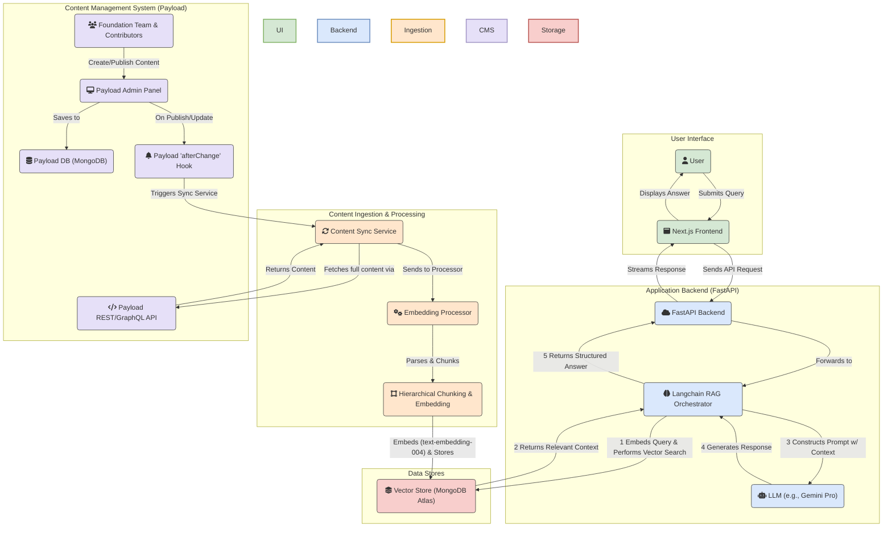

# **Project Roadmap: Litecoin Knowledge Hub**

## **Project Scope & Objectives**

A RAG (Retrieval-Augmented Generation) Chatbot for Litecoin users is an AI-powered conversational tool that provides real-time, accurate answers about Litecoin by retrieving relevant data from verified sources. It aims to solve the problem of misinformation and scattered resources by offering a centralized, reliable way for users to access Litecoin-related information, such as transactions, wallet management, and market insights. This will enhance user experience and foster greater adoption of Litecoin.

* Establish and maintain a canonical, human-vetted knowledge base managed through **Payload CMS** that serves as the single source of truth for the RAG pipeline, ensuring the highest level of accuracy and clarity while enabling Foundation-controlled editorial workflows.

## **Strategic Value Proposition: Specialist vs. Generalist AI**

This project's value is not in competing with general-purpose AI models like ChatGPT or Grok, but in providing a specialized, high-accuracy information utility for the Litecoin ecosystem. Generalist models, while powerful, are not suitable for tasks requiring real-time, verifiable data from trusted sources.

Our RAG-based approach provides a distinct advantage by:

1. **Ensuring Data Accuracy:** We retrieve information from a curated set of live data sources (e.g., blockchain APIs, market data, official documentation), mitigating the risk of AI "hallucinations."  
2. **Providing Real-Time Information:** Unlike the static knowledge of general models, our system can query live data for features like transaction lookups and current market prices.  
3. **Delivering Verifiable Trust:** Our responses are grounded in specific, trusted data sources managed through professional editorial workflows in Payload CMS, providing a level of reliability that is essential for financial and technical queries.

This focus on specialized, real-time, and accurate data is the core differentiator that makes the Litecoin RAG Chat a valuable and necessary tool for its target audience.

## **Key Features & User Stories**

* **Primary Goal(s):**  
  * Deliver accurate, real-time responses to Litecoin-related queries using open-source data like blockchain records, market APIs, and community resources.  
  * Simplify user access to Litecoin information, reducing reliance on fragmented or unverified sources.  
  * Increase user engagement and trust in the Litecoin ecosystem through reliable, conversational support.  
* **Target Users/Audience:**  
  * Litecoin users (novice and experienced)  
  * Cryptocurrency enthusiasts  
  * Developers building on Litecoin  
  * Potential adopters seeking reliable information about Litecoin's features, transactions, or market trends.

### **Phase 1: MVP Core**

* **MVP Core: Content-Driven RAG Foundation**  
  * **Description:** The core of the MVP is to establish a robust, content-first RAG pipeline where a trusted knowledge base serves as the single source of truth. This is achieved by integrating **Payload CMS** as the professional-grade content management system. This system (**the tool**) is used to create and manage a **Curated Knowledge Base** (**the asset**), which will be initially populated with **Litecoin Basics & FAQ** content (**the outcome**). The entire system will then be deployed to production, making the chatbot publicly accessible.  
  * **Primary Goals:**  
    * **Foundation Editorial Control:** Implement Payload's role-based system where community contributors create drafts and the Foundation team controls publishing decisions.  
    * **Flexible Content Structuring:** Leverage Payload's customizable content types (collections) to structure data for optimal RAG performance.  
    * **Real-time Synchronization:** Establish afterChange hook-based synchronization between Payload CMS and the RAG pipeline for immediate content updates.  
    * **Initial Launch Content:** Provide clear, concise answers to fundamental questions about Litecoin to cater to new users. Example Queries: "What is Litecoin?", "How is Litecoin different from Bitcoin?", "How do I get a Litecoin wallet?"  
    * **Production Deployment:** Deploy the frontend (Next.js), backend (FastAPI), and Payload CMS applications to their respective hosted services, making the application stable and public.  
  * **User Story:** A Foundation editor can review, approve, and publish community-contributed articles through Payload's admin panel. Once published, the content is automatically synchronized with the RAG pipeline, ensuring the chatbot immediately uses the most up-to-date, verified information without manual intervention.

### **Phase 2: User Experience & Accuracy Enhancements (Planned)**

* **Trust & Transparency (Source Citations):** Implement in-line citations in AI responses, linking directly to retrieved source documents for verifiability.  
* **Contextual Discovery (AI-Generated Follow-up Questions):** Enhance user engagement by generating 2-3 relevant, clickable follow-up questions after each chatbot response.  
* **Upgraded Retrieval Engine (Hybrid Search & Re-ranking):** Enhance document retrieval accuracy by combining vector similarity with keyword search (hybrid search) and re-ranking retrieved documents for optimal relevance.  
* **User Feedback Loop:** Introduce a mechanism for users to provide direct feedback on AI answer quality, enabling continuous improvement and data collection.

### **Phase 3: Live Data & Developer Integrations (Planned)**

* **Transaction & Block Explorer:** Allows users to look up details of Litecoin transactions and blocks.  
* **Market Data & Insights:** Delivers real-time Litecoin price information, market capitalization, and trading volume.  
* **Developer Documentation & Resources:** Provides quick access to snippets from Litecoin developer documentation and technical resources.

## **Architectural Overview & Patterns**

The MVP architecture is designed around two primary workflows: content management/ingestion and user query processing. The following diagram illustrates the end-to-end system for Phase 1\.

## **Core Technology Decisions**

* (Summary, see techStack.md for details)  
  * Frontend: Next.js, Tailwind CSS  
  * Backend: Python, FastAPI  
  * Content Management: Payload CMS (self-hosted), MongoDB  
  * Vector Database: MongoDB Atlas Vector Search  
  * Content Processing: JSON to structured data/Markdown, hierarchical chunking  
  * Embedding: Google Text Embedding 004  
  * Integration: Payload REST/GraphQL API, afterChange hooks  
  * Deployment: Vercel (frontend), TBD (backend), self-hosted (Payload)

## **Major Milestones & Tentative Timelines**

*(Timelines to be determined)*

### **Phase 1: MVP Foundation & Launch**

*The goal of this phase is to launch a functional, reliable chatbot based on a trusted, human-vetted knowledge base.*

* **Milestone 1:** Project Initialization & Documentation Setup \- ✅ **Completed**  
* **Milestone 2:** Basic Project Scaffold (Next.js Frontend, FastAPI Backend) \- ✅ **Completed**  
* **Milestone 3:** Core RAG Pipeline Implementation \- ✅ **Completed**  
* **Milestone 4:** Backend & Knowledge Base Completion (Initial Articles) \- ✅ **Completed**  
* **Milestone 5: Payload CMS Setup & Integration** \- 📝 **Planned**  
  * **Focus:** Configure the self-hosted Payload CMS instance and integrate its API and webhooks with the backend RAG pipeline.  
* **Milestone 6: MVP Content Population & Validation** \- 📝 **Planned**  
  * **Focus:** Populate Payload CMS with the complete "Litecoin Basics & FAQ" knowledge base and validate the end-to-end RAG pipeline.  
* **Milestone 7: MVP Testing, Refinement & Deployment** \- 📝 **Planned**  
  * **Focus:** Conduct comprehensive testing, refine the user interface, and execute the initial production deployment.

### **Phase 2: User Experience & Accuracy Enhancements (Post-MVP)**

*The goal of this phase is to increase user trust, engagement, and the precision of the RAG pipeline.*

* **Milestone 8: Implement Trust and Feedback Features** \- 📝 **Planned**  
* **Milestone 9: Implement Contextual Discovery** \- 📝 **Planned**  
* **Milestone 10: Upgrade Retrieval Engine** \- 📝 **Planned**

### **Phase 3: Live Data & Developer Integrations (Post-MVP)**

*The goal of this phase is to expand the chatbot's capabilities by integrating real-time data sources and specialized developer tools.*

* **Milestone 11: Implement Transaction & Block Explorer** \- 📝 **Planned**  
* **Milestone 12: Implement Market Data & Insights** \- 📝 **Planned**  
* **Milestone 13: Implement Developer Documentation & Resources** \- 📝 **Planned**

## **Completion Criteria**

* The **MVP Core Foundation** is successfully deployed and operational.  
* Payload CMS is fully integrated with an automated RAG pipeline synchronization.  
* The Foundation editorial workflow is established and operational in Payload CMS.  
* Comprehensive monitoring and analytics systems are in place.  
* User feedback collection and iteration mechanisms are operational (as part of Phase 2).

## **Log of Completed Major Milestones/Phases**

* **Milestone 1: Project Initialization & Documentation Setup** - Completed 6/5/2025
    * Initial `cline_docs` created and populated.
* **Milestone 2: Basic Project Scaffold (Next.js Frontend, FastAPI Backend)** - Completed 6/5/2025
    * Frontend (Next.js) and Backend (FastAPI) directory structures established.
    * Basic "Hello World" functionality confirmed for both.
* **Milestone 3: Core RAG Pipeline Implementation** - Completed 6/6/2025
    * **Data Ingestion Framework:** Implemented and tested multi-source data loaders (Markdown, GitHub, Web).
    * **Embedding:** Integrated Google Text Embedding 004.
    * **Vector Store:** Set up and integrated MongoDB Atlas Vector Search.
    * **Retrieval:** Implemented document retrieval based on similarity search.
    * **Generation:** Integrated Langchain with `ChatGoogleGenerativeAI` (`gemini-pro`) to generate answers from retrieved context.
    * **API:** `/api/v1/chat` endpoint created and functional, returning both the generated answer and source documents for transparency.
    * **Testing:** Standalone test script (`backend/test_rag_pipeline.py`) created to validate the end-to-end pipeline.
    * **Enhancement (6/6/2025):** The RAG pipeline was significantly enhanced by implementing hierarchical chunking for Markdown, specific `task_type` usage for `text-embedding-004`, and an improved LLM prompt template.
    * **Enhancement (6/6/2025):** Implemented metadata filtering capabilities.
* **Milestone 4: Backend & Knowledge Base Completion (MVP Feature 1: Litecoin Basics & FAQ)** - Completed 6/7/2025
    * **Data Source CRUD API:** Implemented a full suite of CRUD API endpoints (`/api/v1/sources`) for managing data sources.
    * **Full Knowledge Base Ingestion:** Successfully ingested and validated the entire initial knowledge base.
    * **Advanced Metadata Filtering:** Enhanced the vector search index to support filtering on all available metadata fields.
* **Strategic Decision: CMS Pivot to Payload** - Completed 6/19/2025
    * **CMS Re-evaluation:** Conducted a comparative analysis of Ghost, Strapi, and Payload.
    * **Architecture Planning:** Designed a new integration architecture for Payload using its REST/GraphQL API and `afterChange` hooks.
    * **Strategic Decision:** Decided to pivot from Strapi to Payload to better align with the project's long-term RAG and data governance goals. *(This completed task enables the work for the planned Milestone 5).*