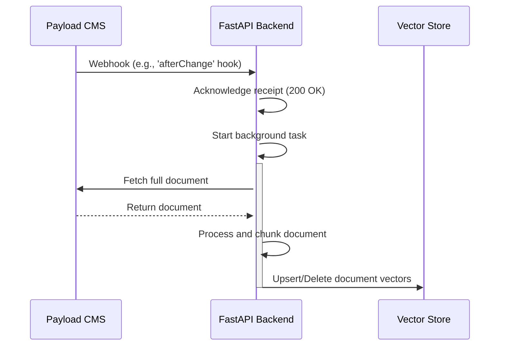

# System Integration Blueprint

This document outlines the integration points and data flows between the various components of the Litecoin RAG Chat system.

## 1. Frontend to Backend Communication

The frontend (Next.js) will communicate with the backend (FastAPI) via a RESTful API.

### 1.1. Endpoints

*   **`POST /api/v1/chat`**:
    *   **Description**: Submits a user's query to the backend for processing.
    *   **Request Body**:
        ```json
        {
          "query": "string",
          "session_id": "string"
        }
        ```
    *   **Response Body**:
        ```json
        {
          "response": "string",
          "sources": [
            {
              "title": "string",
              "url": "string"
            }
          ]
        }
        ```

## 2. Backend to Payload CMS Communication

The backend will communicate with the Payload CMS to retrieve content for the RAG pipeline.

### 2.1. API Client

A Python client will be created in `backend/api_client/payload_client.py` to handle all communication with the Payload CMS. This client will be responsible for:

*   Authenticating with the Payload CMS API.
*   Fetching collections of documents.
*   Fetching individual documents.

### 2.2. Event-Driven Integration (afterChange Hook)

The integration is event-driven, using Payload's `afterChange` hook, which is more robust and deeply integrated than traditional webhooks.

*   **Trigger**: The `afterChange` hook is configured to fire after a document in a specified collection (e.g., 'Articles') is successfully created or updated.
*   **Endpoint**: The hook sends a `POST` request to the backend's synchronization endpoint: `POST /api/v1/sync/payload`.
*   **Payload**: The `afterChange` hook payload is highly configurable. For our use case, it will include the document `id` and the `collection` slug.
    ```json
    {
      "doc": {
        "id": "60d21b4667d0d8992e610c85",
        "status": "published",
        // ... other fields from the document
      },
      "collection": "articles"
    }
    ```
*   **Action**: Upon receiving the hook, the Content Sync Service will:
    1.  Acknowledge receipt immediately with a `200 OK` response.
    2.  Trigger an asynchronous background task.
    3.  The background task will use the `id` from the payload to fetch the full, updated document from the Payload REST API.
    4.  The fetched content is then processed, chunked, embedded, and upserted into the MongoDB Atlas Vector Store.

## 3. Data Synchronization Process

The following diagram illustrates the data synchronization process from Payload CMS to the vector store:



## 4. Error Handling

*   **Webhook Failures:** If the backend fails to process a webhook, it should be logged and retried. A dead-letter queue can be implemented to handle persistent failures.
*   **API Errors:** The frontend should handle API errors gracefully, displaying an appropriate message to the user.
*   **Data Inconsistency:** A periodic reconciliation process will be run to ensure the vector store is in sync with the Payload CMS. This will involve fetching all documents from the CMS and comparing them to the documents in the vector store.

## 5. Security

*   **Webhook Security:** The webhook endpoint will be secured using a secret token that is shared between the Payload CMS and the backend.
*   **API Security:** The backend API will be protected by an API key or other authentication mechanism to prevent unauthorized access.
