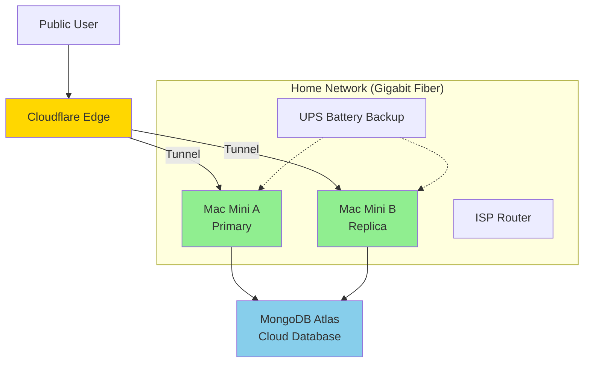

# Cloud Deployment Readiness & Private Cloud Strategy

## Executive Summary

**Current Status**: ✅ **Not yet ready for Public Cloud** - "Private Cloud" strategy selected.

**Decision**: Instead of migrating to Google Cloud Platform (GCP) immediately, we will upgrade the local environment to a High Availability (HA) cluster.

**New Architecture**:
- **Compute**: 2x Apple M1 Mac Minis (Primary + Replica)
- **Network**: Cloudflare Tunnel (Load Balanced/Failover)
- **Power**: Dedicated UPS Battery Backup
- **Connectivity**: 1Gbps Fiber (450 Mbps Upload)
- **Database**: MongoDB Atlas (Cloud) - Stateless compute, cloud data

## Why This Strategy Wins

1. **Cost Efficiency**: Cloud costs would be ~$142/month. A second Mac Mini (~$350) pays for itself in **2.5 months**.
2. **Performance**: Your residential upload speed (450 Mbps) exceeds standard cloud VPS bandwidth tiers.
3. **Reliability**: Adding a second node and UPS removes the "Single Point of Failure" risk.
4. **Zero Downtime**: You can restart one Mac (updates/deployments) while the other handles traffic.
5. **Disaster Recovery**: By keeping database in cloud (MongoDB Atlas), site-level disasters don't cause data loss.

## Deployment Thresholds

### ✅ Stay on Private Cloud (Mac Cluster) If:

1. **Traffic is below 20,000 users/day**
   - Two M1 chips combined provide massive throughput
   - Network bandwidth (450 Mbps upload) can handle thousands of concurrent text streams

2. **Hardware Utilization is Healthy**
   - Cluster CPU load < 70%
   - RAM usage < 12GB per node

3. **Budget is Priority**
   - You prefer CAPEX (One-time hardware purchase) over OPEX (Monthly cloud rent)

### 🚀 Migrate to Google Cloud When:

1. **Physical Limitations are Met**
   - Traffic exceeds 450 Mbps sustained upload bandwidth
   - Concurrent connections overwhelm the residential router's NAT table

2. **Global Latency Matters**
   - You need users in Europe/Asia to have <100ms latency (Cloud CDN/Edge required)

3. **Compliance/SLA**
   - Enterprise clients require SOC2 compliance or guaranteed 99.99% SLAs that residential ISPs cannot legally provide

## Cost Analysis: Private vs. Public

### Option A: Private Cloud Cluster (Selected)

**One-Time Investment (CAPEX)**:
- 2nd Mac Mini (Used M1, 16GB): ~$350
- UPS Battery Backup (1500VA): ~$150
- **Total CAPEX: ~$500**

**Monthly Operating Costs (OPEX)**:
- Electricity (2 Macs + Network): ~$10-15/mo
- MongoDB Atlas (M0/M2): $0-9/mo (start free, scale as needed)
- Cloudflare Zero Trust: $0/mo
- **Total OPEX: ~$15-24/mo**

**Pros**:
- ✅ **High Availability**: No downtime if one machine dies
- ✅ **Zero Downtime Deploys**: Update Node A while Node B serves traffic
- ✅ **Asset Ownership**: You own the hardware
- ✅ **Cost Savings**: ~$127/month vs GCP (~$1,500/year savings)
- ✅ **Stateless Architecture**: Database in cloud = fireproof data

**Cons**:
- ❌ **ISP Risk**: If a fiber line is cut outside your house, both nodes go offline
- ❌ **Disaster Risk**: Fire/Flood affects both nodes (but data is safe in cloud)
- ❌ **No Geographic Distribution**: All traffic routes through single location

### Option B: Google Cloud Platform (Future State)

**Monthly Infrastructure Costs (Estimated)**:

#### Option 1: Cloud Run (Serverless - Recommended)
```
Backend (Cloud Run):
- CPU: 2 vCPU
- Memory: 4GB
- Requests: ~23,000/day
- Estimated: $30/month

Payload CMS (Cloud Run):
- CPU: 1 vCPU
- Memory: 2GB
- Estimated: $20/month

MongoDB Atlas:
- M5 cluster (2GB RAM, 10GB storage): ~$30/month
- OR M10 cluster (if data > 5GB): ~$57/month
- Start with M5, upgrade to M10 when needed

Redis (Memorystore):
- 1GB cache
- Estimated: $35/month

Cloud Run Domain Mapping:
- SSL termination & custom domains included (no extra cost)
- Load balancing handled natively by Cloud Run
- $0 (vs $18/mo for separate Load Balancer)

Total: ~$115-142/month (depending on MongoDB tier)
```

**Break-Even Analysis**:
- Staying on Private Cloud saves ~$127/month compared to GCP
- The $500 hardware investment is recouped in **~4 months**

**Pros**:
- ✅ Auto-scaling
- ✅ High availability (99.9%+ SLA)
- ✅ Geographic distribution
- ✅ Managed services
- ✅ No hardware maintenance
- ✅ Better for 20,000+ users/day or when you need 99.9%+ uptime

**Cons**:
- ❌ Higher cost (8-10x Private Cloud: $115-142 vs $15-24/month)
- ❌ More complex setup
- ❌ Vendor lock-in
- ❌ Learning curve

## Recommended Architecture: The "Home Data Center"

We utilize **Cloudflare Tunnel** in "Replica Mode" to treat both Mac Minis as a single logical origin.



### Implementation Details

1. **Redundancy**: Both Macs run `cloudflared` with the **same tunnel token**
2. **Load Balancing**: Cloudflare automatically distributes requests to available nodes
3. **Failover**: If Mac A loses power or reboots, traffic shifts 100% to Mac B instantly
4. **Stateless Compute**: Both nodes connect to MongoDB Atlas (cloud) - no local database
5. **Zero Data Loss**: If house burns down, data survives in MongoDB Atlas

### The "Stateless Home Lab" Strategy

**Key Principle**: Treat Mac Minis as **ephemeral compute nodes**. No persistent data of value is stored on the physical machines.

**Data Persistence (The "Golden Copy")**:
- **Database**: MongoDB Atlas (Cloud) - NOT hosted locally
  - *Cost*: Start with M0 (Free) or M2 ($9/mo)
  - *Benefit*: If the house burns, your user data survives
- **Code**: All code committed to GitHub
- **Env Vars**: Encrypted copy stored in 1Password/Bitwarden
- **Assets**: Can be stored in S3/R2 or backed up nightly to cloud

## Disaster Recovery & Risk Mitigation

### The "Site Failure" Risk (Fire/Flood/Theft)

**Risk**: Since both nodes (Mac Minis) are in the same physical location, a site-level disaster destroys the entire cluster.

**Mitigation Strategy: Stateless Architecture**

By keeping the database in MongoDB Atlas (cloud), we ensure that **zero unique data lives on the Mac Minis**. This makes the setup "fireproof" from a data perspective.

### The "House Fire" Protocol

If the worst happens, your recovery plan is the **Google Cloud Deployment Playbook**.

1. **Event**: House is lost. Mac Minis are destroyed.
2. **Immediate Action**: Go to a coffee shop (or use your phone).
3. **Execution**: Run the `scripts/deploy-gcp.sh` script from your repo.
4. **Result**:
   - Google Cloud Run spins up (replacing the Mac Minis)
   - It connects to MongoDB Atlas (which is safe)
   - It pulls code from GitHub (which is safe)
   - **Outcome**: You are back online in **15-30 minutes** with **zero data loss**

### Revised Cost/Risk Profile

| Component | Location | Risk of Fire | Impact | Recovery Cost |
|-----------|----------|--------------|--------|---------------|
| **Compute** | Home (Mac Cluster) | **High** | Service Offline | ~$142/mo (Switch to GCP) |
| **Database** | **Cloud (Atlas)** | **Zero** | None | $0 (Already in cloud) |
| **Code** | GitHub | **Zero** | None | $0 |
| **Backups** | Cloud Storage | **Zero** | None | $0 |

**Verdict**: By moving *only* the Database to the cloud (MongoDB Atlas), you insulate yourself from catastrophic loss of the house while maintaining the $127/mo savings on compute.

**RTO (Recovery Time Objective)**: < 30 Minutes  
**RPO (Recovery Point Objective)**: < 1 Second (Zero data loss)

## Revised Migration Roadmap

### Phase 1: Hardware Acquisition (Immediate)

1. Purchase 2nd M1 Mac Mini (16GB RAM recommended)
2. Purchase UPS (Uninterruptible Power Supply) - Ensure Router & Modem are plugged in
3. Connect both units via Ethernet for stability

### Phase 2: Cluster Configuration (This Month)

1. **Sync Environment**: Ensure Node B has identical Docker/Env configuration to Node A
2. **Configure Cloudflare**: Install `cloudflared` on Node B using the existing token
3. **Database Migration**: Move MongoDB to Atlas (if not already there)
   - *Option A (Simpler)*: Both Nodes connect to MongoDB Atlas (Cloud) - **Recommended**
   - *Option B (Cheaper)*: Run Mongo on Node A, replica on Node B (Requires advanced config)
   - *Recommendation*: Stick with Atlas M0/M2 for now to keep state management simple
4. **Test Failover**: Unplug Node A ethernet and verify app stays online via Node B
5. **Verify Stateless**: Ensure both nodes can start fresh and connect to Atlas

### Phase 3: Operations & Drills

1. **Deployment Script**: Update deploy scripts to push to Node A, check health, then push to Node B
2. **Monitoring**: Set up Prometheus/Grafana to monitor *both* nodes on a single dashboard
3. **Disaster Recovery Drill**: Test the "House Fire" protocol by deploying to GCP from scratch

### Phase 4: Public Cloud (Future Trigger)

- **Trigger**: When 450 Mbps upload is saturated or compliance requirements demand it
- **Action**: Execute the [Google Cloud Deployment Playbook](./GOOGLE_CLOUD_DEPLOYMENT_PLAYBOOK.md)

## Decision Matrix: Revised

| Factor | Single Mac Mini | **Private Cloud Cluster** (Selected) | Google Cloud |
|--------|----------------|----------------------------------------|-------------|
| **Setup Cost** | $0 | ~$500 (One-time) | $0 |
| **Monthly Cost** | ~$5-10 | ~$15-24 | ~$115-142 |
| **Reliability** | Low (SPOF) | **High (HA)** | Very High (SLA) |
| **Max Capacity** | ~10k users | **~20k users** | Unlimited |
| **Maintenance** | Manual | **Semi-Automated** | Managed |
| **Bandwidth** | 450 Mbps | **450 Mbps** | Scalable |
| **Disaster Recovery** | None | **Stateless (Cloud DB)** | Built-in |
| **Zero Downtime Deploys** | ❌ | **✅** | ✅ |
| **Data Safety** | Local only | **Cloud DB** | Cloud DB |

## Final Recommendation

**Build the Cluster.**

Your internet connection (symmetric fiber) is the "Unfair Advantage" that makes this possible. By adding redundancy (2nd Mac) and power protection (UPS), you eliminate the biggest risks of self-hosting while saving ~$1,500/year in cloud fees.

The **stateless architecture** (compute at home, data in cloud) provides the best of both worlds:
- **Cost savings** of self-hosted compute
- **Data safety** of cloud-hosted database
- **Disaster recovery** via the GCP playbook

## Migration Readiness Checklist

### Technical Readiness

- [x] All services containerized (✅ Done - Docker)
- [x] Environment variables documented (✅ Done)
- [x] Health checks implemented (✅ Done)
- [x] Monitoring in place (✅ Done - Prometheus/Grafana)
- [x] Logging configured (✅ Done)
- [ ] **Database migrated to Atlas** (Required for stateless architecture)
- [ ] **2nd Mac Mini acquired and configured**
- [ ] **UPS installed and tested**
- [ ] **Cloudflare Tunnel configured for both nodes**
- [ ] Backup/restore procedures (Need to document)
- [ ] CI/CD pipeline (Optional but recommended)

### Operational Readiness

- [ ] Team trained on cluster operations
- [ ] Cost monitoring/alerts configured
- [ ] Security best practices implemented
- [x] Disaster recovery plan (✅ GCP Playbook)
- [ ] Rollback procedures documented
- [ ] Support plan (who handles issues?)

### Business Readiness

- [x] Budget approved for hardware ($500 one-time)
- [x] Growth projections justify cluster setup
- [ ] Uptime requirements defined
- [ ] Migration timeline planned

## Cost Comparison at Different Scales

| Users/Day | Single Mac | Private Cloud Cluster | GCP Cost (Cloud Run) | Best Option |
|-----------|------------|----------------------|---------------------|-------------|
| 500 | $5-10 | $15-24 | $50-80 | 🏆 Single Mac |
| 2,000 | $5-10 | $15-24 | $80-120 | 🏆 Private Cluster |
| 5,000 | $5-10 | $15-24 | $115-150 | 🏆 Private Cluster |
| 10,000 | $5-10 | $15-24 | $180-220 | 🏆 Private Cluster |
| 20,000 | ❌ Hardware limit | $15-24 | $300-400 | 🏆 Private Cluster |
| 50,000+ | ❌ | ❌ Bandwidth limit | $400-600 | 🏆 GCP |

**Break-even point**: Private Cloud Cluster pays for itself in ~4 months vs GCP, and handles up to 20,000 users/day.

## Next Steps

1. **Immediate**: Purchase 2nd Mac Mini and UPS
2. **This Week**: Set up MongoDB Atlas (if not already done)
3. **This Month**: Configure cluster with Cloudflare Tunnel
4. **Short-term** (1-3 months): Test failover, run disaster recovery drill
5. **Medium-term** (3-6 months): Monitor cluster performance, reassess based on traffic growth
6. **When Ready**: Execute production migration to GCP using playbook (traffic > 20,000 users/day or bandwidth saturated)

## Recommended Action Plan

### ✅ Do Now (This Week)
1. **Purchase hardware** - 2nd Mac Mini + UPS
2. **Set up MongoDB Atlas** - Migrate database to cloud (if not already done)
3. **Document current setup** - Full documentation of Mac Mini deployment

### ⚠️ Prepare (This Month)
1. **Configure cluster** - Set up Node B with identical environment
2. **Configure Cloudflare** - Set up tunnel on both nodes
3. **Test failover** - Verify traffic shifts between nodes
4. **Update monitoring** - Add Node B to Prometheus/Grafana dashboard

### 🚀 Execute (When Hardware Arrives)
1. **Hardware setup** - Install UPS, connect both Macs via Ethernet
2. **Cluster deployment** - Deploy services to both nodes
3. **Load testing** - Verify cluster handles traffic correctly
4. **Disaster drill** - Test GCP deployment from scratch

## References

- [Google Cloud Deployment Playbook](./GOOGLE_CLOUD_DEPLOYMENT_PLAYBOOK.md) - Your disaster recovery plan
- [Capacity Planning Guide](./CAPACITY_PLANNING.md)
- [Deployment Guide](./DEPLOYMENT.md)
- [Environment Variables](./ENVIRONMENT_VARIABLES.md)
- [Cloudflare Tunnel Documentation](https://developers.cloudflare.com/cloudflare-one/connections/connect-apps/)
- [MongoDB Atlas Pricing](https://www.mongodb.com/pricing)
